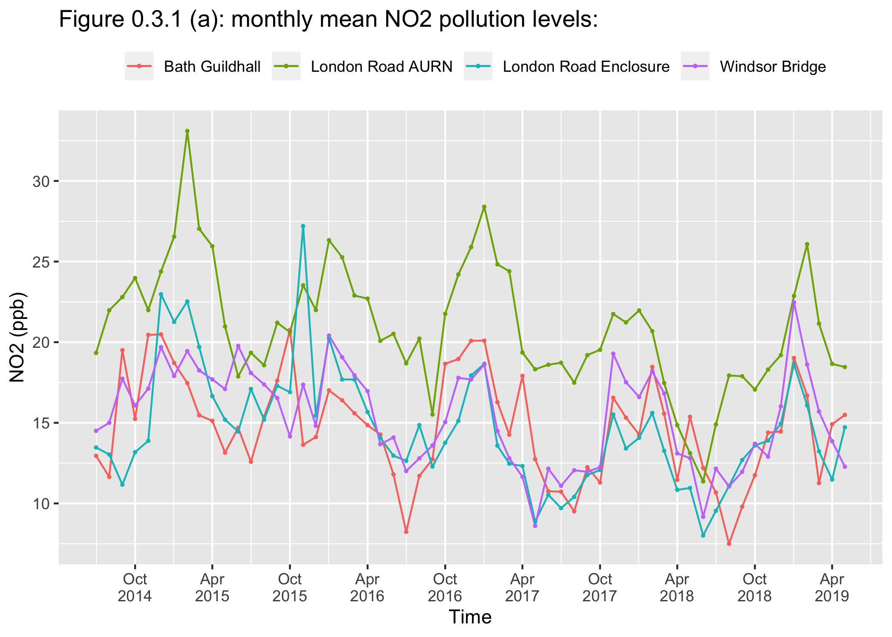
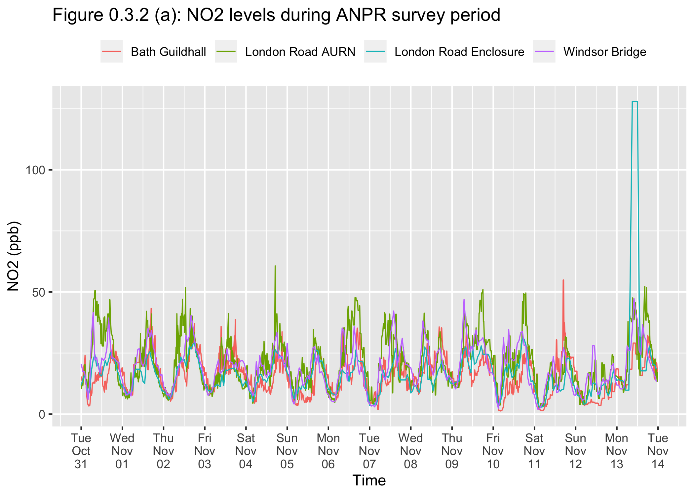
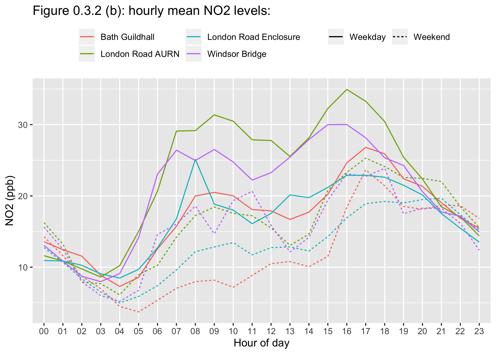

0.3 - NO2 pollution data analysis
================

``` r
#Load in packages and data:
library(tidyverse); library(reshape2); library(gridExtra)
load("../0.1.2 - Data/air.entire.rda")
load("../0.1.2 - Data/air.data.rda")
```

Using the data sets **air.entire.rda** and **air.data.rda**, NO2 pollution data collected from all four of the monitoring stations is analysed in this section. There are some observations with negative values, these are sensor failures. For example, for the London Road Automatic Urban and Rural Network (AURN) site:

``` r
air.entire %>% filter(`Sensor Location Name` == "London Road AURN") %>% filter(NO2<0,NOx<0,NO<0) %>% select(DateTime,NO2,NO,NOx) %>% head() %>% data.frame()
```

| DateTime            |   NO2|        NO|       NOx|
|:--------------------|-----:|---------:|---------:|
| 2014-07-09 01:00:00 |  -0.4|  -18.5000|  -19.0000|
| 2014-07-09 01:15:00 |  -0.1|  -18.2998|  -18.3999|
| 2014-07-11 01:30:00 |  -0.1|  -18.6997|  -18.7998|
| 2014-07-13 04:45:00 |  -0.4|  -17.2998|  -17.5996|
| 2017-05-16 19:30:00 |  -1.6|  -18.5000|  -20.0996|
| 2017-05-16 19:45:00 |  -3.2|  -21.5000|  -24.6997|

These observations will be filtered out when performing the analysis in the next subsections.

0.3.1 - Monthly average NO2 pollution levels:
=============================================

Figure 0.3.1 (a), shows monthly average NO2 pollution levels from 8th July 2014 - 5th May 2019, for each of the four air pollution monitoring stations; Bath Guildhall, London Road AURN, London Road Enclosure, and Windsor Bridge.

``` r
#Filter out negative values and calculate means: London Road AURN & Bath Guildhall:
air.entire %>% filter(`Sensor Location Name` %in% c("London Road AURN","Bath Guildhall"))%>% filter(NO2>0) %>% group_by(DateTime=cut(as.POSIXct(DateTime), breaks="1 month"),`Sensor Location Name`) %>% summarise(NO2=mean(NO2)) -> mean.air.entire.15m

#Filter out negative values and calculate means: London Road Enclosure & Windsor Bridge:
air.entire %>% filter(`Sensor Location Name` %in% c("London Road Enclosure","Windsor Bridge")) %>% filter(NO2>0,NOx>0,NO>0,NO2<250) %>% group_by(DateTime=cut(as.POSIXct(DateTime), breaks="1 month"),`Sensor Location Name`) %>% summarise(NO2=mean(NO2)) -> mean.air.entire.1h

#Plot NO2 monthly means:
ggplot() +
#Add London Road AURN & Bath Guildhall:
geom_line(melt(mean.air.entire.15m), mapping = aes(x=as.POSIXct(DateTime), y=value, colour=`Sensor Location Name`),size=0.5,alpha=1) + 
geom_point(melt(mean.air.entire.15m), mapping = aes(x=as.POSIXct(DateTime), y=value, colour=`Sensor Location Name`),size=0.5,alpha=1) +

#Add London Road Enclosure & Windsor Bridge:
geom_line(melt(mean.air.entire.1h), mapping=aes(x=as.POSIXct(DateTime), y=value, colour=`Sensor Location Name`),size=0.5,alpha=1) + 
geom_point(melt(mean.air.entire.1h), mapping=aes(x=as.POSIXct(DateTime), y=value, colour=`Sensor Location Name`),size=0.5,alpha=1) + 
  
#Legend theme and labels: 
theme(legend.position = "top") + scale_x_datetime(date_breaks = "6 month",date_labels ='%b\n%Y') + ylab("NO2 (ppb)") + ggtitle("Figure 0.3.1 (a): monthly mean NO2 pollution levels:") + labs(color="",linetype="") + xlab("Time")
```



There is annual seasonality for NO2 measured across all four monitoring stations. NO2 pollution levels peak during winter months and oscillate to their lowest levels during summer months. It is important to consider in later sections, that the 2017 ANPR survey was carried out during 31st October - 13th November, a time of the year where some of the highest NO2 pollution levels are observed.

0.3.2 - NO2 pollution data during 2017 ANPR survey period:
==========================================================

In this subsection, NO2 pollution data collected during the 2017 ANPR survey period (31st October - 13th November 2017) is analysed.

``` r
#NO2 graph: (We have to filter out missing values)
air.data %>% ggplot() + geom_line(mapping=aes(x=as.POSIXct(DateTime),y=NO2,colour=`Sensor Location Name`),alpha=1,size=0.4) + scale_x_datetime(date_breaks = "1 day",date_labels ='%a\n%b\n%d') -> NO2.graph

#Return graphs:
NO2.graph + ggtitle("Figure 0.3.2 (a): NO2 levels during ANPR survey period") + xlab("Time") + theme(legend.position="top") + labs(color="") + ylab("NO2 (ppb)")
```



Figure 0.3.2 (a), shows measured NO2 levels during the ANPR survey period for each of the four air pollution monitoring stations. There appears to be a sensor failure for the London Road Enclosure monitoring station on Monday 13th November, where unusually high levels of NO2 have been recorded.

There is clearly daily seasonality, with NO2 levels increasing through the day and decreasing through the night. There is also a weekly seasonality where NO2 levels are higher on weekdays and then decrease over the weekend, reaching their lowest levels on Sundays.

Examining the daily seasonality and weekend effect of NO2 levels further, figure 0.3.2 (b) shows hourly mean NO2 levels for weekdays vs weekends, for each of the monitoring stations, during the ANPR survey period. The high levels of NO2 recorded on Monday 13th November for the London Road Enclosure monitoring station have been excluded from the calculation of the hourly means.

``` r
weekend <- c("Saturday","Sunday")
weekdays <- c("Monday","Tuesday","Wednesday","Thursday","Friday")

#Graphs Data:
air.data %>% filter(weekdays(as.POSIXct(DateTime))%in%weekend,NO2<100|is.na(NO2),PM10<900|is.na(PM10)) %>% group_by(hour_of_day=factor(substring(DateTime,12,13)),`Sensor Location Name`) %>% summarise(NO2=mean(NO2,na.rm = TRUE),PM10=mean(PM10,na.rm = TRUE)) -> weekend.mean.data

air.data %>% filter(weekdays(as.POSIXct(DateTime))%in%weekdays,NO2<100|is.na(NO2),PM10<900|is.na(PM10)) %>% group_by(hour_of_day=factor(substring(DateTime,12,13)),`Sensor Location Name`) %>% summarise(NO2=mean(NO2,na.rm = TRUE),PM10=mean(PM10,na.rm = TRUE)) -> weekdays.mean.data

weekend.mean.data %>% mutate(`Weekend or weekday`="Weekend") -> weekend.mean.data
weekdays.mean.data %>% mutate(`Weekend or weekday`="Weekday") -> weekdays.mean.data

#NO2 Graph:
ggplot() + geom_line(weekend.mean.data,mapping=aes(x=hour_of_day,y=NO2,colour=`Sensor Location Name`,group=`Sensor Location Name`,linetype = `Weekend or weekday`),alpha=1,size=0.5) + geom_line(weekdays.mean.data,mapping=aes(x=hour_of_day,y=NO2,colour=`Sensor Location Name`,group=`Sensor Location Name`,linetype = `Weekend or weekday`),alpha=1,size=0.5) -> NO2.weekend


#Return graphs:
NO2.weekend + ggtitle("Figure 0.3.2 (b): hourly mean NO2 levels:") + xlab("Hour of day") + ylab("NO2 (ppb)") + theme(legend.position = "top") + labs(color="",linetype="") + guides(color=guide_legend(ncol=2))
```



Hourly mean NO2 levels are higher during weekdays than at the weekend. There are two peaks in hourly mean NO2 levels during weekdays and at at the weekend. However during weekdays, these peaks are similar in height, in comparison to the weekend, where the first peak has a smaller amplitude than the second peak. For weekdays the first peak is around 7-10am and the second peak is around 3-5pm, coinciding with rush hour traffic times.
