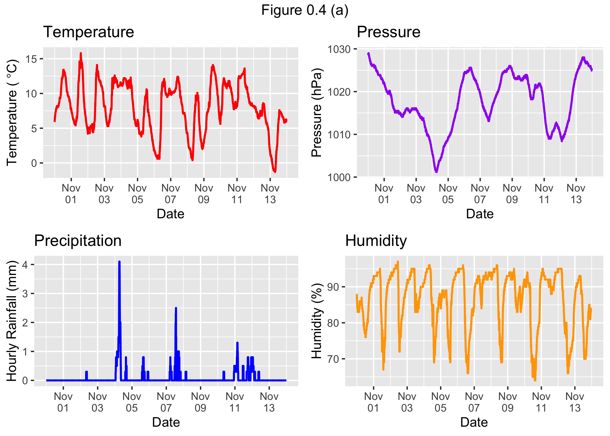
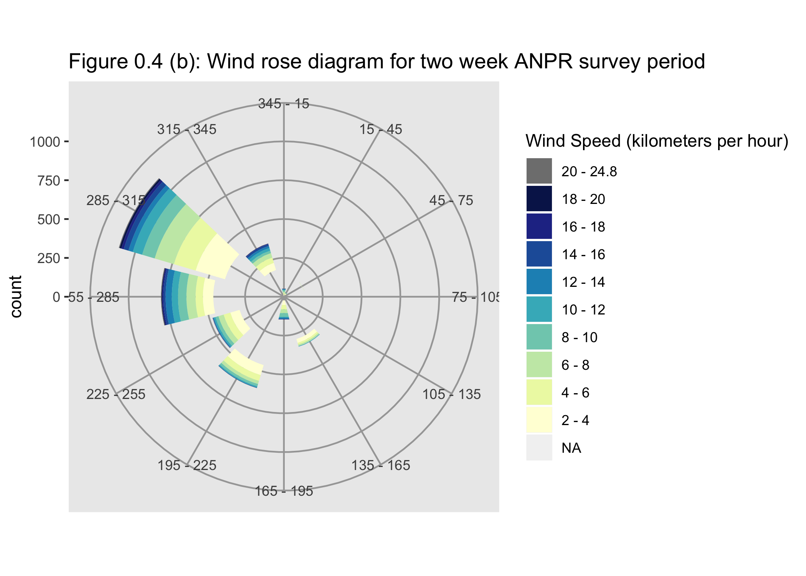

0.4 - Weather data analysis
================

Using the data set **weather.data.rda**, weather data observed during the two week ANPR survey period (31st October - 13th November 2017) is analysed in this section.

``` r
#Loading in the packages and data:
library(tidyverse)
library(broom)
library(lubridate)
require(RColorBrewer)
library(gridExtra)
load("../0.1.2 - Data/weather.data.rda")

#Windrose Diagram function from: https://rpubs.com/mariner610/windrose:
plot.windrose <- function(data,
                      spd,
                      dir,
                      spdres = 2,
                      dirres = 30,
                      spdmin = 2,
                      spdmax = 20,
                      spdseq = NULL,
                      palette = "YlGnBu",
                      countmax = NA,
                      debug = 0){


# Look to see what data was passed in to the function
  if (is.numeric(spd) & is.numeric(dir)){
    # assume that we've been given vectors of the speed and direction vectors
    data <- data.frame(spd = spd,
                       dir = dir)
    spd = "spd"
    dir = "dir"
  } else if (exists("data")){
    # Assume that we've been given a data frame, and the name of the speed 
    # and direction columns. This is the format we want for later use.    
  }
  # Tidy up input data ----
  n.in <- NROW(data)
  dnu <- (is.na(data[[spd]]) | is.na(data[[dir]]))
  data[[spd]][dnu] <- NA
  data[[dir]][dnu] <- NA

  # figure out the wind speed bins ----
  if (missing(spdseq)){
    spdseq <- seq(spdmin,spdmax,spdres)
  } else {
    if (debug >0){
      cat("Using custom speed bins \n")
    }
  }
  # get some information about the number of bins, etc.
  n.spd.seq <- length(spdseq)
  n.colors.in.range <- n.spd.seq - 1

  # create the color map
  spd.colors <- colorRampPalette(brewer.pal(min(max(3,
                                                    n.colors.in.range),
                                                min(9,
                                                    n.colors.in.range)),                                               
                                            palette))(n.colors.in.range)

  if (max(data[[spd]],na.rm = TRUE) > spdmax){    
    spd.breaks <- c(spdseq,
                    max(data[[spd]],na.rm = TRUE))
    spd.labels <- c(paste(c(spdseq[1:n.spd.seq-1]),
                          '-',
                          c(spdseq[2:n.spd.seq])),
                    paste(spdmax,
                          "-",
                          max(data[[spd]],na.rm = TRUE)))
    spd.colors <- c(spd.colors, "grey50")
  } else{
    spd.breaks <- spdseq
    spd.labels <- paste(c(spdseq[1:n.spd.seq-1]),
                        '-',
                        c(spdseq[2:n.spd.seq]))    
  }
  data$spd.binned <- cut(x = data[[spd]],
                         breaks = spd.breaks,
                         labels = spd.labels,
                         ordered_result = TRUE)
  # clean up the data
  data. <- na.omit(data)

  # figure out the wind direction bins
  dir.breaks <- c(-dirres/2,
                  seq(dirres/2, 360-dirres/2, by = dirres),
                  360+dirres/2)  
  dir.labels <- c(paste(360-dirres/2,"-",dirres/2),
                  paste(seq(dirres/2, 360-3*dirres/2, by = dirres),
                        "-",
                        seq(3*dirres/2, 360-dirres/2, by = dirres)),
                  paste(360-dirres/2,"-",dirres/2))
  # assign each wind direction to a bin
  dir.binned <- cut(data[[dir]],
                    breaks = dir.breaks,
                    ordered_result = TRUE)
  levels(dir.binned) <- dir.labels
  data$dir.binned <- dir.binned

  # Run debug if required ----
  if (debug>0){    
    cat(dir.breaks,"\n")
    cat(dir.labels,"\n")
    cat(levels(dir.binned),"\n")       
  }  

  # deal with change in ordering introduced somewhere around version 2.2
  if(packageVersion("ggplot2") > "2.2"){    
    data$spd.binned = with(data, factor(spd.binned, levels = rev(levels(spd.binned))))
    spd.colors = rev(spd.colors)
  }

  # create the plot ----
  p.windrose <- ggplot(data = data,
                       aes(x = dir.binned,
                           fill = spd.binned)) +
    geom_bar() + 
    scale_x_discrete(drop = FALSE,
                     labels = waiver()) +
    coord_polar(start = -((dirres/2)/360) * 2*pi) +
    scale_fill_manual(name = "Wind Speed (kilometers per hour)", 
                      values = spd.colors,
                      drop = FALSE) +
    #theme_bw() +
    theme(axis.title.x = element_blank(),
          #panel.border = element_rect(colour = "blank"),
          panel.grid.major = element_line(colour="grey65"))

  # adjust axes if required
  if (!is.na(countmax)){
    p.windrose <- p.windrose +
      ylim(c(0,countmax))
  }

  # print the plot
  #print(p.windrose)  

  # return the handle to the wind rose
  return(p.windrose)
}
```

``` r
#Temperature:
ggplot()+
  geom_line(data=weather.data,aes(x=as.POSIXct(Time),y=TemperatureC),size=0.8,alpha=1,color="red")+ scale_x_datetime(date_breaks = "2 days",date_labels = "%b\n%d") + ggtitle("Temperature") + xlab("Date") + ylab(expression("Temperature ("*~degree*C*")")) -> temp

#Air pressure:
ggplot()+geom_line(data=weather.data,aes(x=as.POSIXct(Time),y=PressurehPa),size=0.8,alpha=1,colour="purple") + scale_x_datetime(date_breaks = "2 days",date_labels = "%b\n%d") + ggtitle("Pressure") + xlab("Date") + ylab("Pressure (hPa)") -> pres

#Precipitation:
ggplot()+geom_line(data=weather.data,aes(x=as.POSIXct(Time),y=HourlyPrecipMM),size=0.8,alpha=1,colour="blue") + scale_x_datetime(date_breaks = "2 days",date_labels = "%b\n%d") + ggtitle("Precipitation") + xlab("Date") + ylab("Hourly Rainfall (mm)") -> precip

#Humidity

ggplot()+geom_line(data=weather.data,aes(x=as.POSIXct(Time),y=Humidity),size=0.8,alpha=1,colour="orange") + scale_x_datetime(date_breaks = "2 days",date_labels = "%b\n%d") + ggtitle("Humidity") + xlab("Date") + ylab("Humidity (%)") -> humid

grid.arrange(temp,pres,precip,humid,top="Figure 0.4 (a)")
```



Figure 0.4 (a) shows graphs of the measured temperature, pressure, precipitation and humidity during the 2017 ANPR survey.

Daily seasonality can be observed in the temperature data. Temperatures are at their highest during the the middle of each day and are at their lowest during the early morning.

There is a decline in air pressure during the first 5 days. A similar decline is seen in the NO2 pollution graphs in section 0.3. In later sections of this study, it will be shown that air pressure has a statistically significant effect on NO2 pollution levels.

The weather is mostly dry for the two week survey period. However, there are some moderate amounts of rain on 4th and 7th November.

There is daily periodicity in the humidity, reaching the lowest values during the middle of the day and then reaches its highest values during the night. There is fluctuation in the troughs of humidity levels. The peaks on the other hand, remain rather consistent.

Figure 0.4 (b) shows a wind rose diagram for the wind speed and direction measured over the two week ANPR period. In creating the wind rose diagram, code was used and adapted from: <https://rpubs.com/mariner610/windrose>.

``` r
plot.windrose(spd = weather.data$WindSpeedKMH,dir = weather.data$WindDirectionDegrees) + ggtitle("Figure 0.4 (b): Wind rose diagram for two week ANPR survey period")
```



There has been some fluctuation in the wind speed and in the wind direction. Later it will be shown that wind direction has a radial effect on NO2 pollution levels.
