1.0 - Traffic flow diagrams
================

In this section, traffic flows into and out of London Road are analysed. London Road has been chosen, since there are two automatic number-plate recognition (ANPR) camera’s capturing both directions of the traffic, within close proximity to the London Road Automatic Urban and Rural Network (AURN) and London Road Enclosure monitoring stations. Later sections of this study will consider the effect of traffic counts captured from the ANPR camera’s on measured NO2 levels, and analyse congestion between the London Road ANPR site and the busiest ANPR sites, that vehicles travel to after visiting the London Road ANPR site, and the busiest ANPR sites that vehicles travel from before visiting the London Road ANPR site.

The data set **obs.type.rda** will be used to analyse the traffic flows. This data set contains the data set **obs.data.rda** merged with the variable **type** from **vehicle.data.rda** and can be found in found in **0.1.3 - Secondary Data/obs.type** along with the file used to create it: **obs.type.rmd**.

The data set **site.data.rda** is used to extract the coordinates of each ANPR site location. Some coordinates will be changed marginally to avoid any overlap of arcs and labels in the the flow diagrams to come later in this section.

``` r
#Loading in the data and the packages:
library(igraph)
library(msm)
library(lubridate)
library(tidyverse)
load("../0.1.3 - Secondary Data/obs.type/obs.type.rda")
load("../0.1.2 - Data/site.data.rda")

#Coordinates and names for each site:
coords<- site.data[duplicated(site.data$location_id),][,c("location_id","longitude","latitude")]
names <- site.data[duplicated(site.data$location_id),][,c("description")]

# Chaning coordinates slightly to avoid overlap on our graphs:
coords[3,"latitude"] <- 51.40400 
coords[4,"latitude"] <- 51.40000
coords[28,"latitude"] <- 51.383
coords[28,"longitude"] <- -2.355
coords[12,"latitude"] <- 51.3968
coords[12,"longitude"] <- -2.368
coords[13,"latitude"] <- 51.393
coords[13,"longitude"] <- -2.368
coords[10,"longitude"] <- -2.39
coords[17,"longitude"] <- -2.3468
coords[5,"latitude"] <- 51.394
```

Flow function:
==============

This is a function which graphs a network of chosen ANPR site locations from the 2017 ANPR survey. Each node is an ANPR site, and each arc shows traffic flows from one site to another.

#### Flow function: "flow.graph", takes in arguments:

-   **data** enter 'obs.type' data as an input
-   **site.coords** Enter 'coords' data as an input
-   **site.names** enter 'names' data as an input
-   **site.vector** a vector of ANPR locations 1-33 e.g. c(2,6,32)
-   **interest.node** removes edges which are not directly connected to the 'interest.node'
-   **flow.min Sets** minimum amount of flow required to be included in the plot
-   **flow.max Sets** maximum amount of flow required to be included in the plot
-   **type** filter by type of vehicle e.g "HCVs", use the command flow.graph.types() to see all possible options.
-   **layout** "coords" is the default option and plots graph vertices with respect to their site coordinates "nice" provides an alternative layout option.
-   **remove.rep.jump** remove transitions between the same node
-   **flow.type** default gives total volumes, if "avg" is specified then the average daily volume is outputted
-   **round** round averages to specified number of decimal places
-   **days** filter by specified days of the week e.g. "Friday" or c("Saturday","Sunday")
-   other arguments: these are igraph plot options (see igraph documentation).

``` r
flow.graph <- function(data,site.coords,site.names,site.vector=NULL,interest.node=NULL,flow.min=NULL,flow.max=NULL,type=NULL,layout=NULL,remove.rep.jump=TRUE,flow.type=NULL,round=1,days=NULL,main=NULL,vertex.size=9,vertex.shape="circle",vertex.frame.color="white",vertex.color=rgb(0.1,0.6,0.8,0.8),vertex.label.color="black",vertex.label.cex=0.9,edge.label.color="black",edge.label.cex=0.55,legend=TRUE,legend.location="bottom",ncol=4){
site.coords <- site.coords
data<- as.data.frame(data) # Data as a data frame

# Select type of vehicle if specified:
if(!is.null(type)) data<- data[data$type==type,]

# Filter days of week if specified:
if(!is.null(days)) data<- data[weekdays.POSIXt(as.POSIXct(data$date)) %in% days,]


#Creating a transition table:
dat <- statetable.msm(location_id,vehicle_id,data=data)

#Convert the transitions table to a data frame:
dat<- as.data.frame(dat) 
#Select subset of sites if specified:
if(!is.null(site.vector)){site.vector <- sort(site.vector)
dat<- dat[(dat$from %in% site.vector)&(dat$to %in% site.vector),]}
dat$from <- as.numeric(dat$from)
dat$to <- as.numeric(dat$to)
#Remove jumps from a node back to the same node:
if (remove.rep.jump==TRUE) dat <- dat[-which(dat$from==dat$to),]

#If specified, remove all other edges expect from the ones which are directly connected to the 'interest.node':
if(!is.null(interest.node)) dat <- dat[-which(dat$from !=interest.node & dat$to !=interest.node),]

dat$from <- factor(dat$from)
dat$to <- factor(dat$to)

# If we choose flow.type as avg:
if(!is.null(flow.type)){
  if(flow.type=="avg"){
  if(!is.null(days)) dat$Freq <- round(dat$Freq/(length(days)*2),round) #average day
  else dat$Freq <- round(dat$Freq/14,round)}} # average for whole period

# Filter minimum flow if specified:
if(!is.null(flow.min)) dat <- dat[which(dat$Freq>=flow.min),]

# Filter maximum flow if specified:
if(!is.null(flow.max)) dat <- dat[which(dat$Freq<=flow.max),]

# Putting transition data in order
dat <- dat[order(dat$from,dat$to),] 

# Creating graph:  
g<- graph_from_edgelist(as.matrix(dat[,c('to','from')]),directed = TRUE)

# Assigning flow's to the edges of the graph:
E(g)$capacity <- dat$Freq

#Layout of graph:
if(is.null(layout) || layout=="coord"){
g$layout <- coord <- as.matrix(site.coords[as.numeric(attr(V(g),"name")),][,c(2,3)])}
else{ if(layout=="nice") g$layout <- layout_nicely(g)}

#Plotting the Graph:
plot.igraph(g, edge.label = E(g)$capacity,asp = 0,vertex.size = vertex.size,vertex.shape = vertex.shape,vertex.frame.color = vertex.frame.color,vertex.color = vertex.color,vertex.label.color=vertex.label.color,vertex.label.cex=vertex.label.cex,edge.arrow.size = 0,edge.label.color=edge.label.color,edge.label.cex = edge.label.cex,layout=g$layout,main=main,edge.color = "lightgray")


#Legend:
if (legend==TRUE){
  vertices <- sort(as.numeric(attr(V(g),"name")))
  description <- site.names[vertices]
legend <- paste(vertices," - ", description)
legend(legend.location,legend=legend,box.lty=2,cex=0.7,inset=c(1,-0.2,0),ncol=ncol)
}
}
flow.graph.types <- function() {x<-unique(obs.type$type);x[is.na(x)==F]}
```

Main ANPR sites vehicles travel to / from London Road:
======================================================

In this subsection, the busiest ANPR sites that vehicles travel to after having been captured by the London Road ANPR camera’s, and the busiest ANPR sites that vehicles travel from before they are captured by the London Road ANPR camera’s, are analysed.

Figure 1.0 (a), shows a graph of daily mean volumes of vehicles recorded travelling to the London Road ANPR site from another ANPR site in Bath, or vice versa, during the 2017 ANPR survey period, where the mean flow is greater than 800 vehicles per day. For example, the mean daily number of vehicles captured first by the Swainswick ANPR camera, and then by the London Road ANPR camera is 2994.1.

The ANPR sites shown on the graph are approximately in their real life locations, where some sites have been moved marginally to avoid overlap of arcs and arc labels. For some sites, only one-direction of the flow is shown, where the flow in the opposite direction is below the minimum of threshold of 800 vehicles per day.

``` r
#Plotting daily traffic volumes into London Road:
flow.graph(obs.type,coords,names,flow.min=800,interest.node=14, flow.type="avg",main="Figure 1.0 (a): Daily mean traffic volumes (>=800)")
```

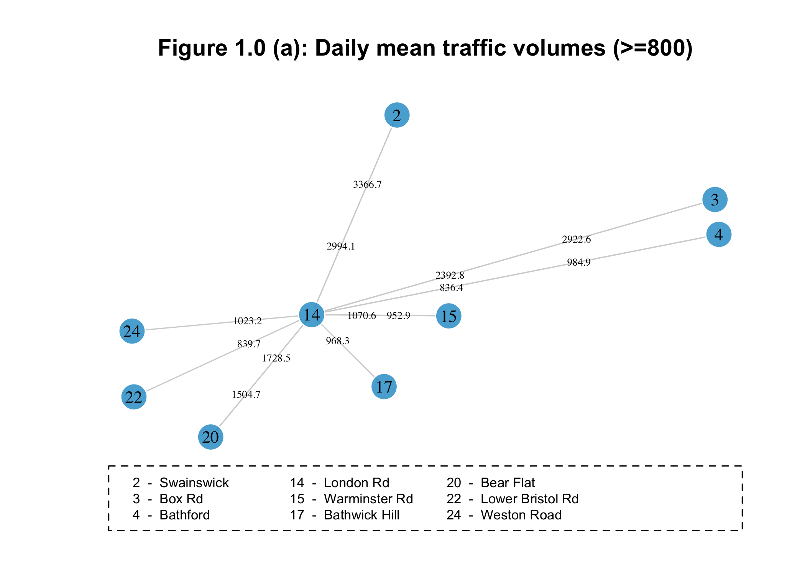

The largest average daily traffic volumes into London Road captured by the ANPR cameras, are from Swainswick, Box Road and Bear Flat. These locations are also the largest flows out from the London Road ANPR site. There are also large average daily flows into London Road from Weston Road, and between London Road and Warminster Road, London Road and Bathford.

Later sections of this study will consider average journey speeds for vehicles travelling between the London Road ANPR site and the busiest ANPR sites; Swainswick, Box Road, Bear Flat and Warminster Road, that vehicles travel to after having been captured at the London Road site first or have visited before having been captured at the London Road site. The average journey speeds will be used to investigate congestion and its effect on NO2 pollution.

Weekend effect on traffic volumes:
==================================

In this subsection, the effect of weekend vs weekdays on daily mean traffic volumes is explored.

Figure 1.0 (b), shows average daily traffic volumes for vehicles recorded travelling to the London Road ANPR site from another ANPR site in Bath, or vice versa, during the weekdays of the 2017 ANPR survey period, where the average flow is greater than 500 vehicles per day. Figure 1.0 (c), shows the same graph, however for weekends during the ANPR survey.

``` r
#Creating vectors for weekdays and days of the weekend:
weekdays <- c("Monday","Tuesday","Wednesday","Thursday","Friday")
weekend  <- c("Saturday","Sunday")
  
flow.graph(obs.type,coords,names,flow.min=500,interest.node=14,flow.type="avg",
           main="Figure 1.0 (b): Daily mean traffic volumes: weekdays (>=500)",days=weekdays,layout="coord")
```

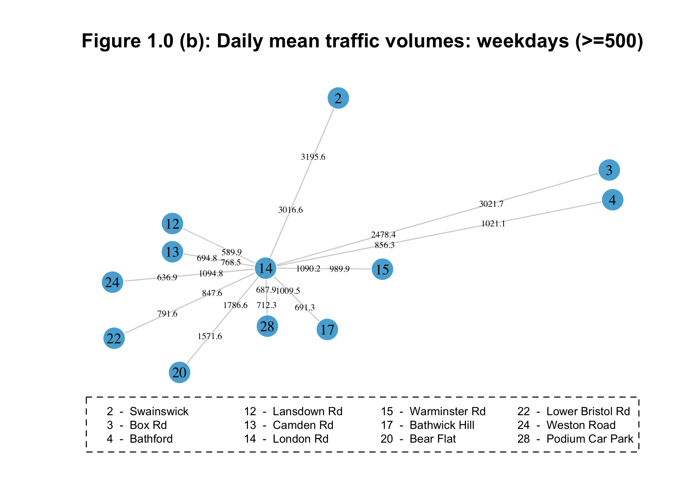

``` r
flow.graph(obs.type,coords,names,flow.min=500,interest.node=14,flow.type="avg",
           main="Figure 1.0 (c): Daily mean traffic volumes: weekends (>=500)",day=weekend,layout="coord")
```

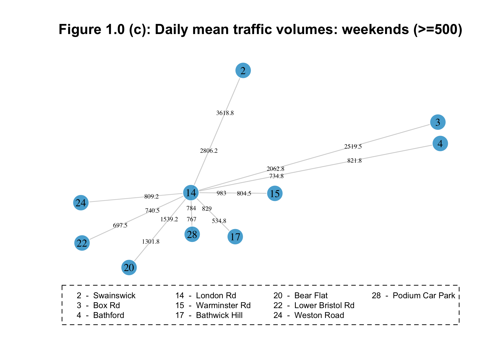

Mean daily volumes on the whole are lower during the weekend period. Less sites achieve the minimum threshold of 500 vehicles in either direction to be included on the graph However, there is an increase in average daily flow from London Road to Swainswick, from 3196 during weekdays to 3619 for weekends.

Main sites that vehicles transition to / from London Road by types of vehicles:
-------------------------------------------------------------------------------

In this subsection, daily mean traffic volumes of cars, heavy commercial vehicles (HCVs), light commercial vehicles (LCVs), and public service vehicles (PSVs) that pass through the London Road ANPR site from or travel to another ANPR site or are explored.

Figure 1.0 (d), shows daily mean volumes for cars recorded travelling to the London Road ANPR site from another ANPR site in Bath, or vice versa, above a minimum threshold of 1000 cars per day.

``` r
#Cars
flow.graph(obs.type,coords,names,interest.node=14 ,flow.type= "avg", main= "Figure 1.0 (d): Daily mean car volumes (>=1000)", type="CARS",layout="coord",flow.min=1000)
```

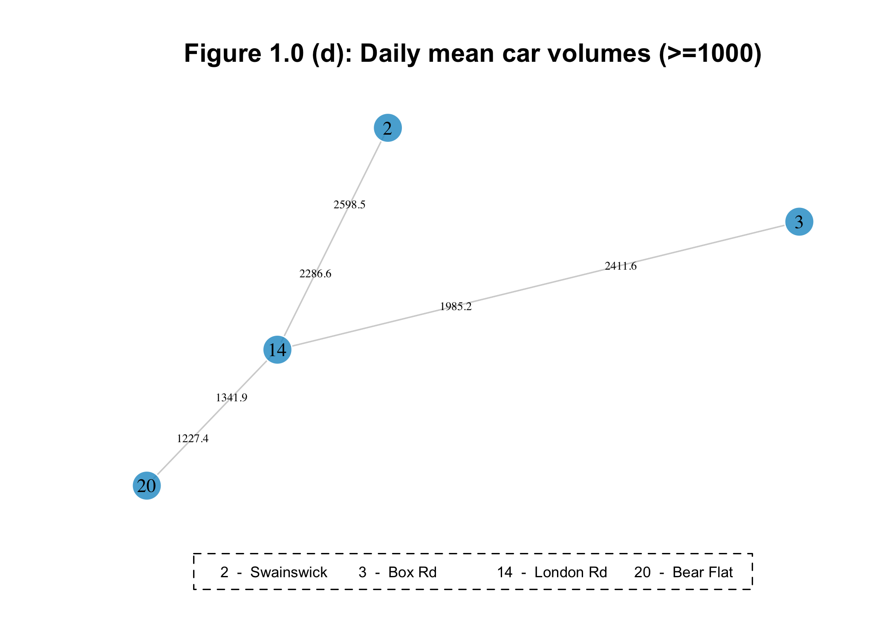

Figure 1.0 (e), shows daily mean volumes for HCVs recorded travelling to the London Road ANPR site from another ANPR site in Bath, or vice versa, above a minimum threshold of 25 HCVs per day.

``` r
#HCVs
flow.graph(obs.type,coords,names,interest.node=14,flow.type="avg",
           main="Figure 1.0 (e): Daily mean HCVs volumes (>=25)",
           type="HCVs",layout="coord",flow.min=25)
```


Figure 1.0 (f), shows daily mean volumes for LCVs recorded travelling to the London Road ANPR site from another ANPR site in Bath, or vice versa, above a minimum threshold of 100 LCVs per day.

``` r
#LCVs
flow.graph(obs.type,coords,names,interest.node=14,flow.type="avg",
           main="Figure 1.0 (f): Daily mean LCVs volumes (>=100)",type="LCVs",
           layout="coord",flow.min=100)
```

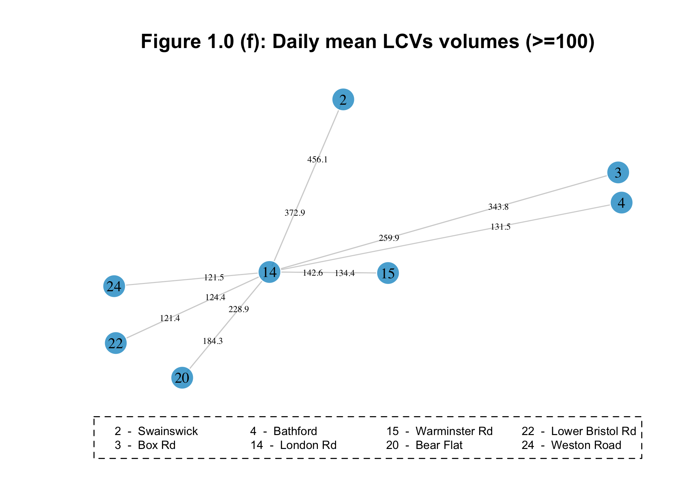

Figure 1.0 (g), shows daily mean volumes for PSVs recorded travelling to the London Road ANPR site from another ANPR site in Bath, or vice versa, above a minimum threshold of 20 PSVs per day.

``` r
#PSVs
flow.graph(obs.type,coords,names,interest.node=14,flow.type="avg",
           main="Figure 1.0 (g): Daily mean daily PSVs volumes (>=20)",
           type="PSVs",layout="coord",flow.min=20)
```

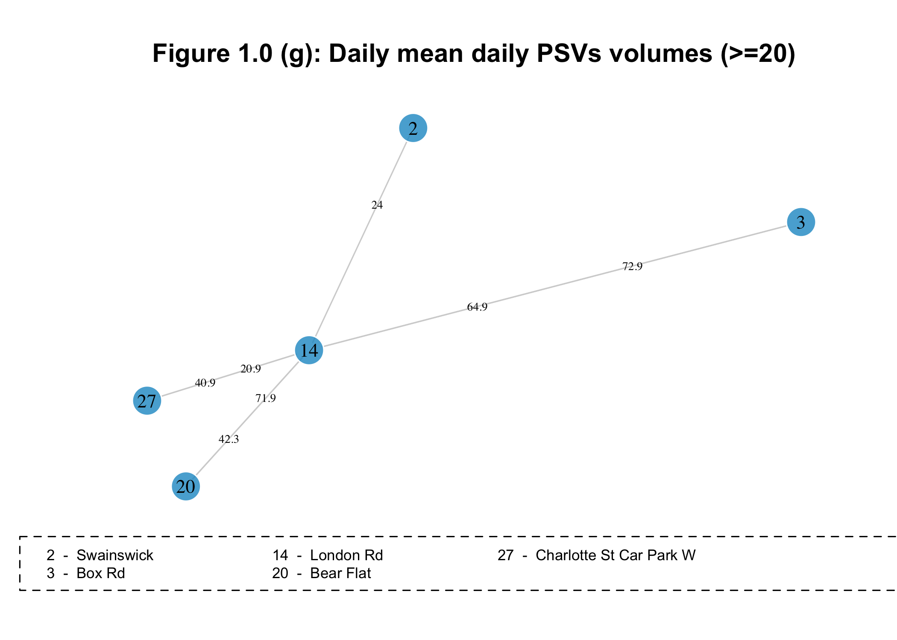

From figures 1.0 (d) - (e), we see that the busiest ANPR sites associated with the London Road ANPR site for:

-   Cars are Swainswick, Box Road and Bear Flat.
-   HCVs are Swainswick and Warminster Road.
-   LCVs are Swainswick, Box Road, Bear Flat and Warminster Road.
-   PSVs are Box Road, Bear Flat, Charlotte St Car Park W, and to Swainswick.

Weekend effect for vehicle type volumes travelling via London Road:
-------------------------------------------------------------------

In this subsection the weekend effect on average daily traffic volumes for each vehicle type is explored.

``` r
#Cars weekdays
flow.graph(obs.type,coords,names,interest.node=14 ,flow.type= "avg", main= "Figure 1.0 (h): Daily mean car volumes: weekdays (>=1000)", type="CARS",layout="coord",flow.min=1000,days=weekdays)
```


``` r
#Cars weekend
flow.graph(obs.type,coords,names,interest.node=14 ,flow.type= "avg", main= "Figure 1.0 (i): Daily mean car volumes: weekend (>=1000)", type="CARS",layout="coord",flow.min=1000,days=weekend)
```

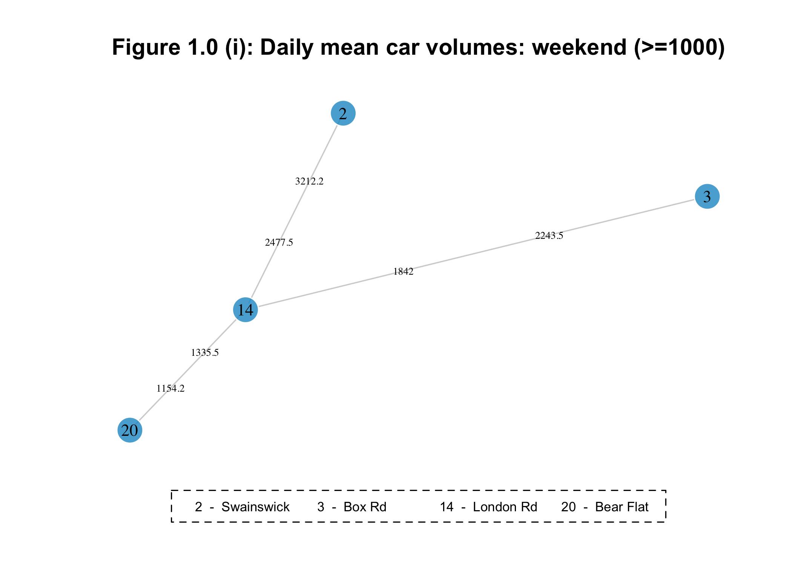

``` r
#HCVs weekdays
flow.graph(obs.type,coords,names,interest.node=14 ,flow.type= "avg", main= "Figure 1.0 (j): Daily mean HCVs volumes: weekdays (>=25)", type="HCVs",layout="coord",flow.min=25,days=weekdays)
```

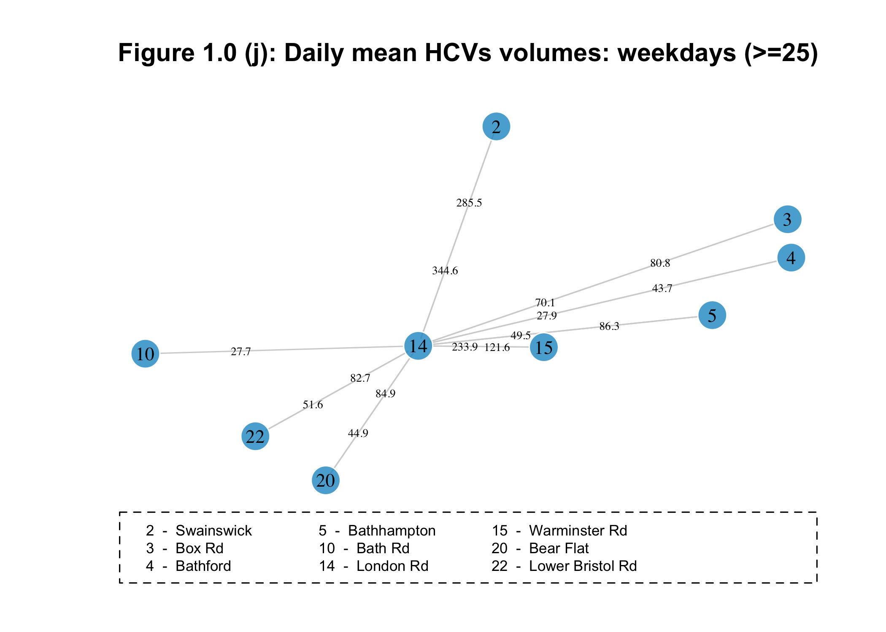

``` r
#HCVs weekend
flow.graph(obs.type,coords,names,interest.node=14 ,flow.type= "avg", main= "Figure 1.0 (k): Daily mean HCVs volumes: weekend (>=25)", type="HCVs",layout="coord",flow.min=25,days=weekend)
```

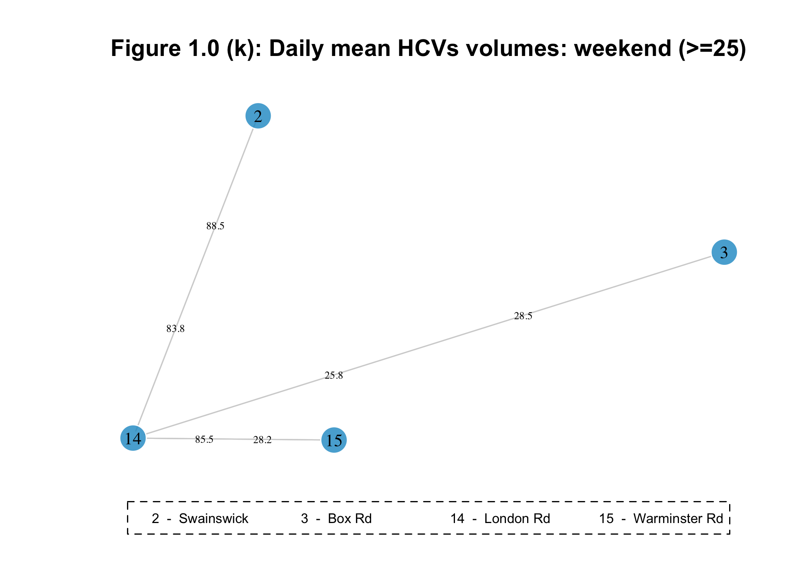

``` r
#LCVs weekdays
flow.graph(obs.type,coords,names,interest.node=14 ,flow.type= "avg", main= "Figure 1.0 (l): Daily mean LCVs volumes: weekdays (>=100)", type="LCVs",layout="coord",flow.min=100,days=weekdays)
```

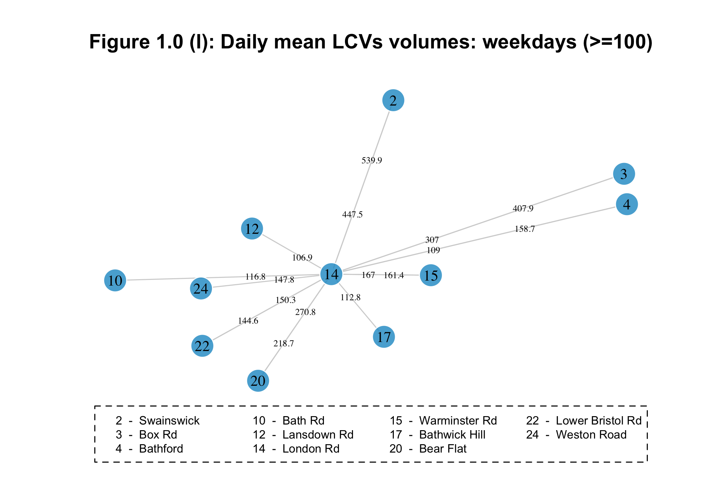

``` r
#LCVs weekend
flow.graph(obs.type,coords,names,interest.node=14 ,flow.type= "avg", main= "Figure 1.0 (m): Daily mean LCVs volumes: weekend (>=100)", type="LCVs",layout="coord",flow.min=100,days=weekend)
```

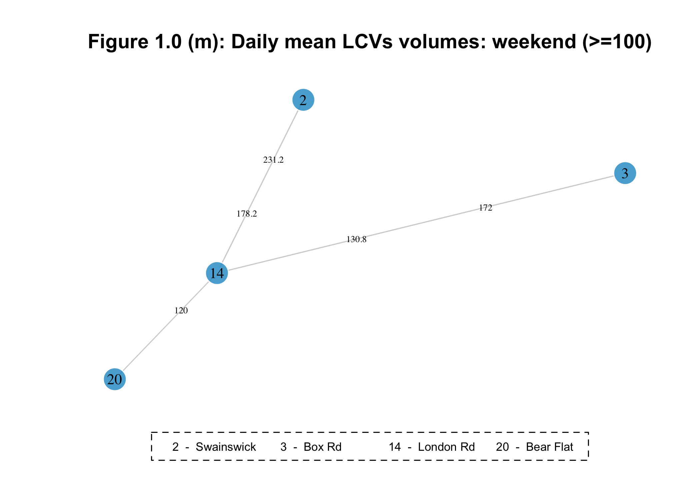

``` r
#PSVs weekdays
flow.graph(obs.type,coords,names,interest.node=14 ,flow.type= "avg", main= "Figure 1.0 (n): Daily mean PSVs volumes: weekdays (>=20)", type="PSVs",layout="coord",flow.min=20,days=weekdays)
```

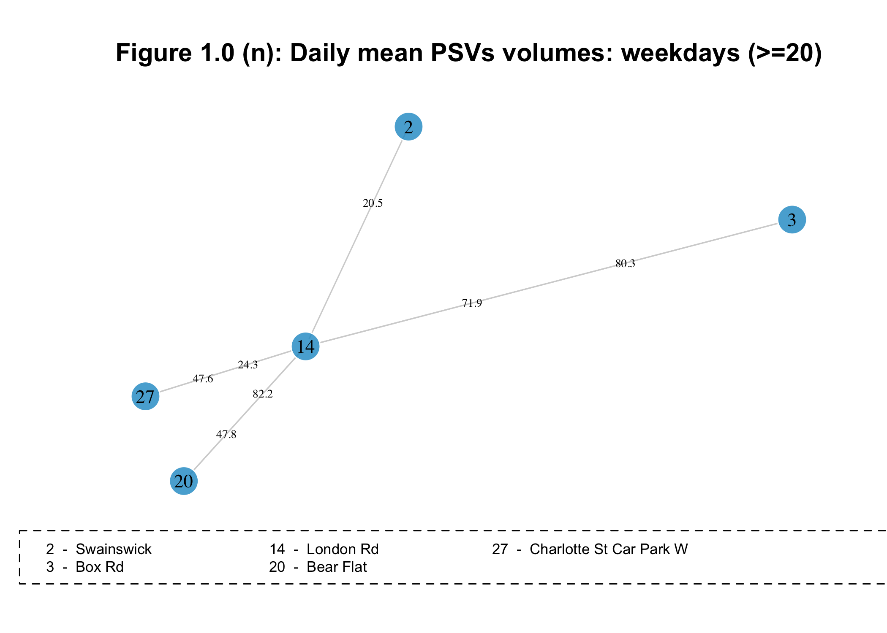

``` r
#PSVs weekend
flow.graph(obs.type,coords,names,interest.node=14 ,flow.type= "avg", main= "Figure 1.0 (o): Daily mean PSVs volumes: weekend (>=20)", type="PSVs",layout="coord",flow.min=20,days=weekend)
```

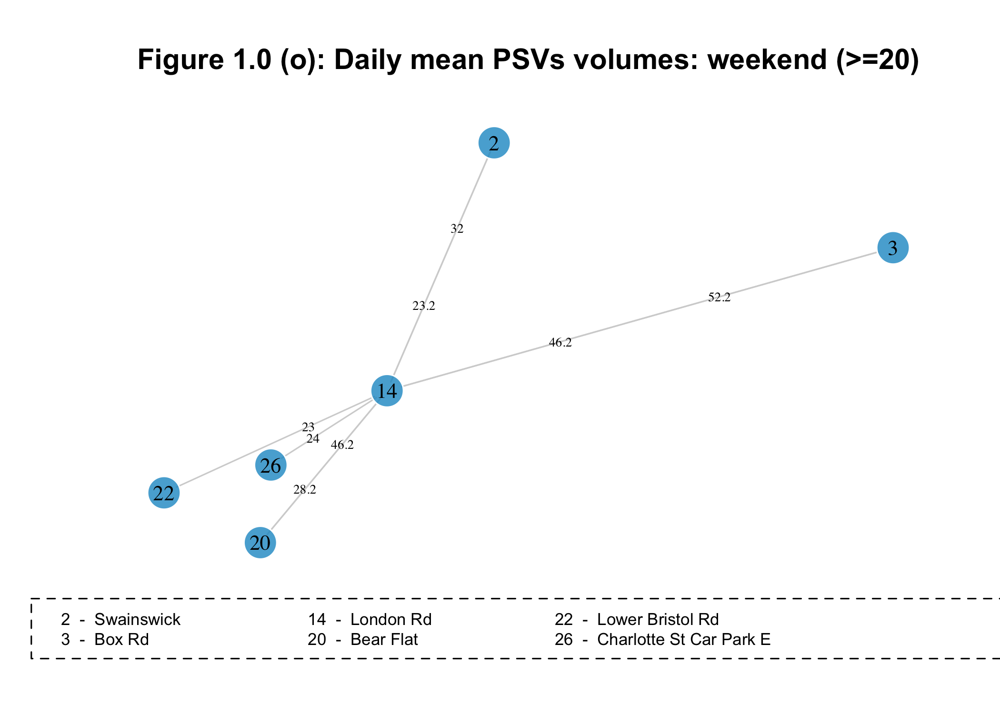

-   Average car volumes are similar on weekdays as on weekends.
-   There are fewer volumes of HCVs seen at weekends than weekdays, and 6 fewer sites make it over the minimum average daily threshold of 25 vehicles. Similar observations can been seen for LCVs.
-   There are fewer volumes of PSVs seen at weekends than weekdays, however there is a new site; Charlotte Street Car park, which makes it over the minimum average daily threshold of 20 vehicles.
