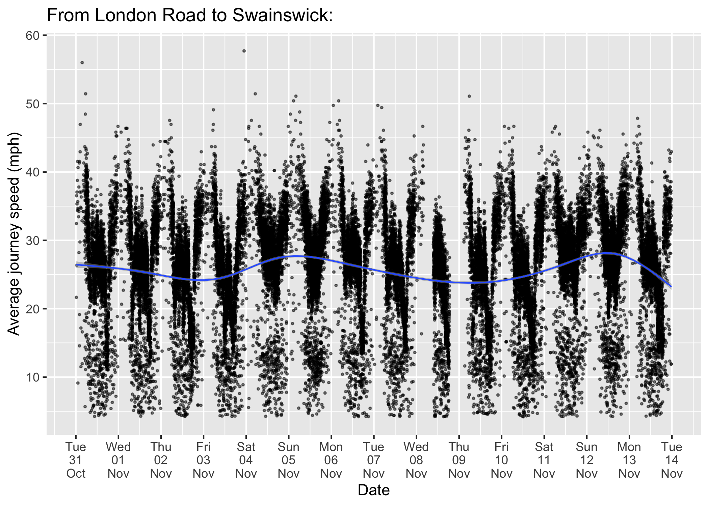
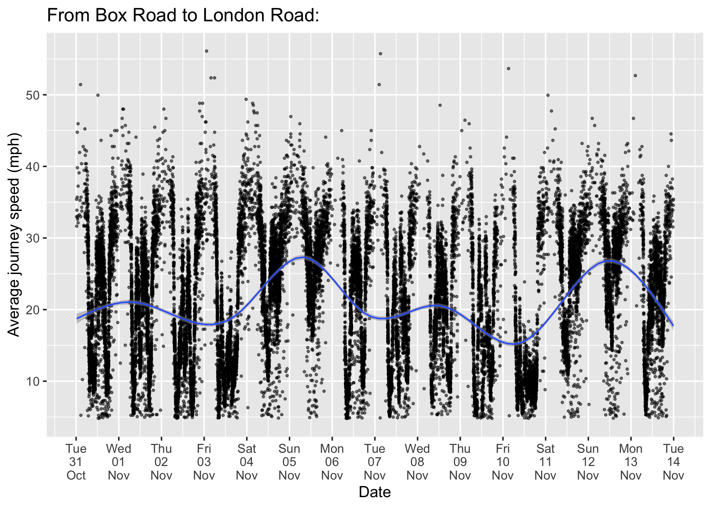
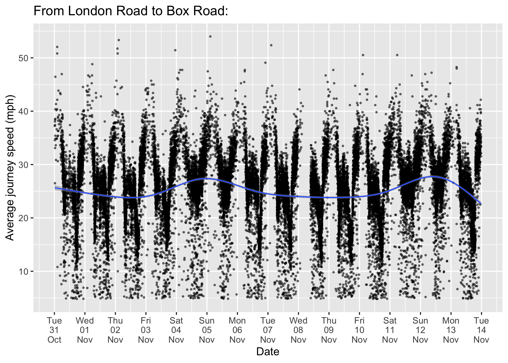
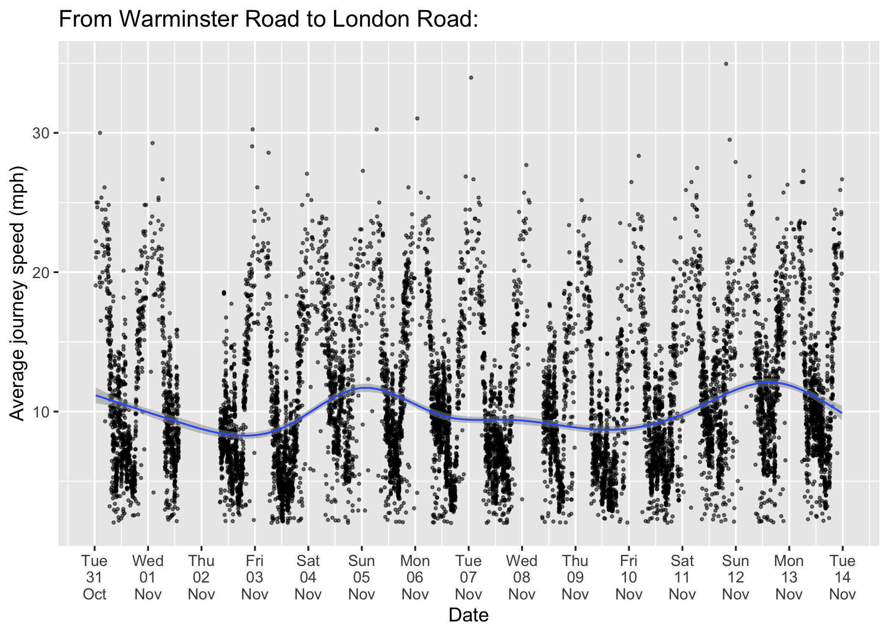
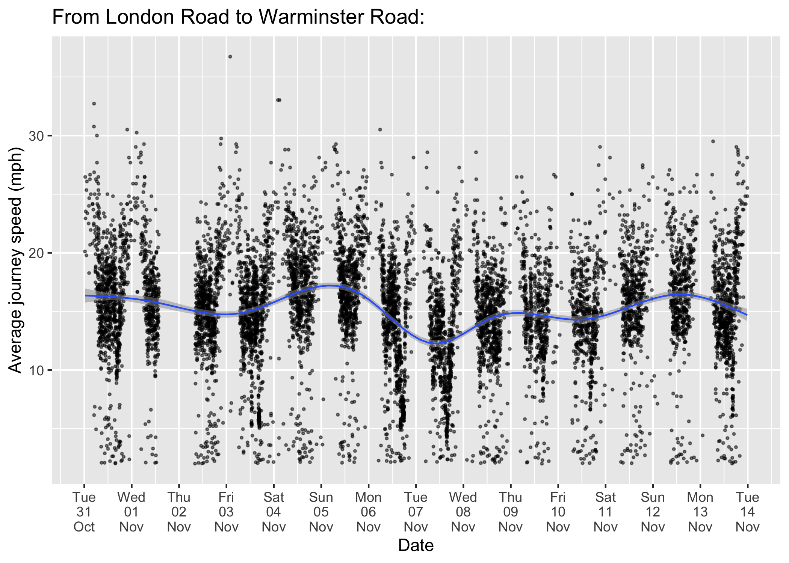
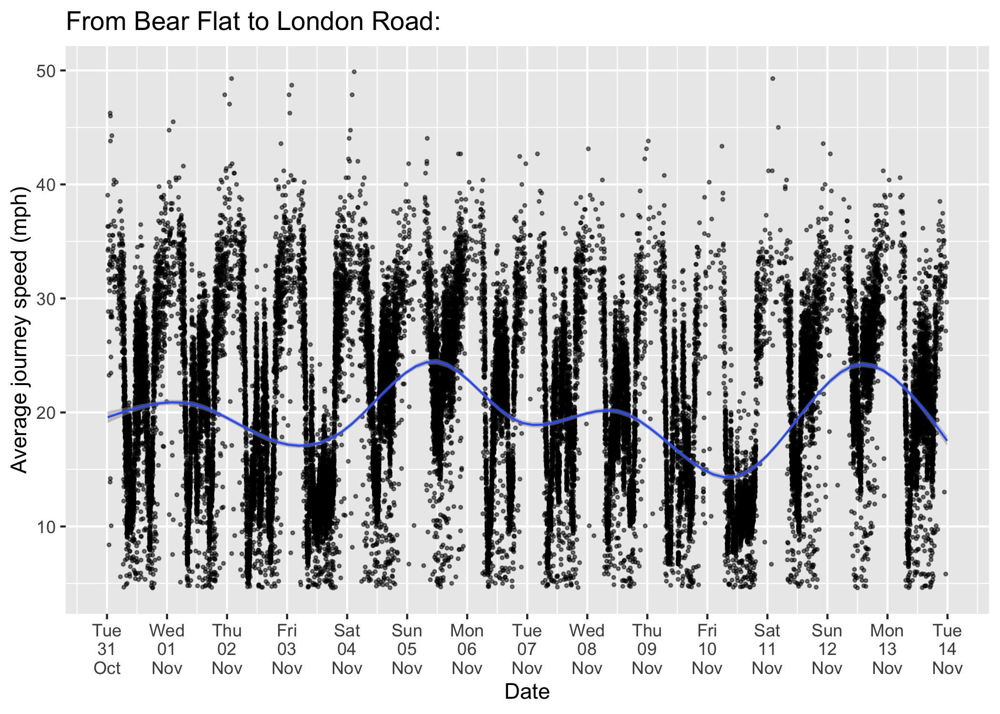

2 - Average journey speed analysis
================

``` r
#Packages and Data:
load("../0.1.3 - Secondary Data/travel.times.london.road/travel.times.london.road.rda")
library(tidyverse)
library(broom)
library(lubridate)
library(gridExtra)
```

This section uses the data set **travel.times.london.road.rda** (a secondary data set of journey times for vehicles which can be found in **0.1.3 - Secondary Data/travel.times.london.road**). The sites in this data set were chosen as the busiest ANPR sites, that vehicles travel to after visiting the London Road ANPR site, or travel from before visiting the London Road ANPR site, according to **figure 1.0 (a)**. Vehicles that took longer than 30 minutes to reach their destination were filtered out.

Data from Google Maps (for the shortest distances between London Road and the busiest ANPR sites) will be used to calculate average journey speeds per 15 minute interval:

``` r
#Loading in distance data obtained manually from Google Maps and merging this onto the data set:
distance_data_google <- read.csv("../0.1.1 - Raw Data/Google Maps Distances Data/distances_london_road.csv")
lr.journey.dist <- merge(travel.times.london.road,distance_data_google[,c(1,2,3,6)],by=c("site_from","site_to"))
lr.journey.dist$average_speed <- lr.journey.dist$distance_miles_fastest_route_google/lr.journey.dist$journey_time
```

Plotting the average journey speed per 15 minute interval against time, from London Road to each site and vice versa:

``` r
#Swainswick:
lr.journey.dist %>% filter(location_from==2) %>% ggplot() + geom_point(aes(x=as.POSIXct(time_from),y=average_speed),size=0.5,alpha=0.5) + ggtitle("From Swainswick to London Road: ") + scale_x_datetime(date_breaks = "1 days",date_labels = "%a\n%d\n%b") + xlab("Date") + ylab("Average journey speed (mph)") + geom_smooth(aes(x=as.POSIXct(time_from),y=average_speed),size=0.5,alpha=0.5)
```


``` r
lr.journey.dist %>% filter(location_to==2) %>% ggplot() + geom_point(aes(x=as.POSIXct(time_from),y=average_speed),size=0.5,alpha=0.5) + ggtitle("From London Road to Swainswick: ") + scale_x_datetime(date_breaks = "1 days",date_labels = "%a\n%d\n%b") + xlab("Date") + ylab("Average journey speed (mph)") + geom_smooth(aes(x=as.POSIXct(time_from),y=average_speed),size=0.5,alpha=0.5)
```



``` r
#Box Road:
lr.journey.dist %>% filter(location_from==3) %>% ggplot() + geom_point(aes(x=as.POSIXct(time_from),y=average_speed),size=0.5,alpha=0.5) + ggtitle("From Box Road to London Road: ") + scale_x_datetime(date_breaks = "1 days",date_labels = "%a\n%d\n%b") + xlab("Date") + ylab("Average journey speed (mph)") + geom_smooth(aes(x=as.POSIXct(time_from),y=average_speed),size=0.5,alpha=0.5)
```



``` r
lr.journey.dist %>% filter(location_to==3) %>% ggplot() + geom_point(aes(x=as.POSIXct(time_from),y=average_speed),size=0.5,alpha=0.5) + ggtitle("From London Road to Box Road: ") + scale_x_datetime(date_breaks = "1 days",date_labels = "%a\n%d\n%b") + xlab("Date") + ylab("Average journey speed (mph)") + geom_smooth(aes(x=as.POSIXct(time_from),y=average_speed),size=0.5,alpha=0.5)
```



``` r
#Warminster Road:
lr.journey.dist %>% filter(location_from==15) %>% ggplot() + geom_point(aes(x=as.POSIXct(time_from),y=average_speed),size=0.5,alpha=0.5) + ggtitle("From Warminster Road to London Road: ") + scale_x_datetime(date_breaks = "1 days",date_labels = "%a\n%d\n%b") + xlab("Date") + ylab("Average journey speed (mph)") + geom_smooth(aes(x=as.POSIXct(time_from),y=average_speed),size=0.5,alpha=0.5)
```



``` r
lr.journey.dist %>% filter(location_to==15) %>% ggplot() + geom_point(aes(x=as.POSIXct(time_from),y=average_speed),size=0.5,alpha=0.5) + ggtitle("From London Road to Warminster Road: ") + scale_x_datetime(date_breaks = "1 days",date_labels = "%a\n%d\n%b") + xlab("Date") + ylab("Average journey speed (mph)") + geom_smooth(aes(x=as.POSIXct(time_from),y=average_speed),size=0.5,alpha=0.5)
```



``` r
#Bear Flat:
lr.journey.dist %>% filter(location_from==2) %>% ggplot() + geom_point(aes(x=as.POSIXct(time_from),y=average_speed),size=0.5,alpha=0.5) + ggtitle("From Bear Flat to London Road: ") + scale_x_datetime(date_breaks = "1 days",date_labels = "%a\n%d\n%b") + xlab("Date") + ylab("Average journey speed (mph)") + geom_smooth(aes(x=as.POSIXct(time_from),y=average_speed),size=0.5,alpha=0.5)
```



``` r
lr.journey.dist %>% filter(location_to==2) %>% ggplot() + geom_point(aes(x=as.POSIXct(time_from),y=average_speed),size=0.5,alpha=0.5) + ggtitle("From London Road to Bear Flat: ") + scale_x_datetime(date_breaks = "1 days",date_labels = "%a\n%d\n%b") + xlab("Date") + ylab("Average journey speed (mph)") + geom_smooth(aes(x=as.POSIXct(time_from),y=average_speed),size=0.5,alpha=0.5)
```


From these graphs there is evidence of congestion for traffic flowing between London Road and the following ANPR sites; Swainswick, Box Road, Bear Flat and Warminster Road.

A daily period pattern can be observed, with average speeds fastest during the night and slowest during the day. During rush hour periods on weekdays, there are two sharp troughs, indicating these are peak times of congestion. Additionally average journey speeds are faster at the weekend, than during weekdays.
