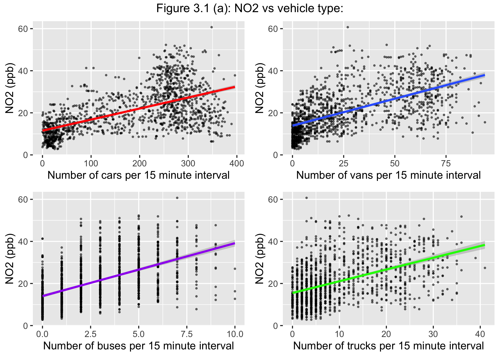
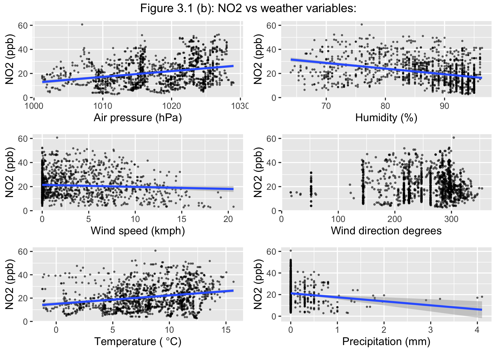
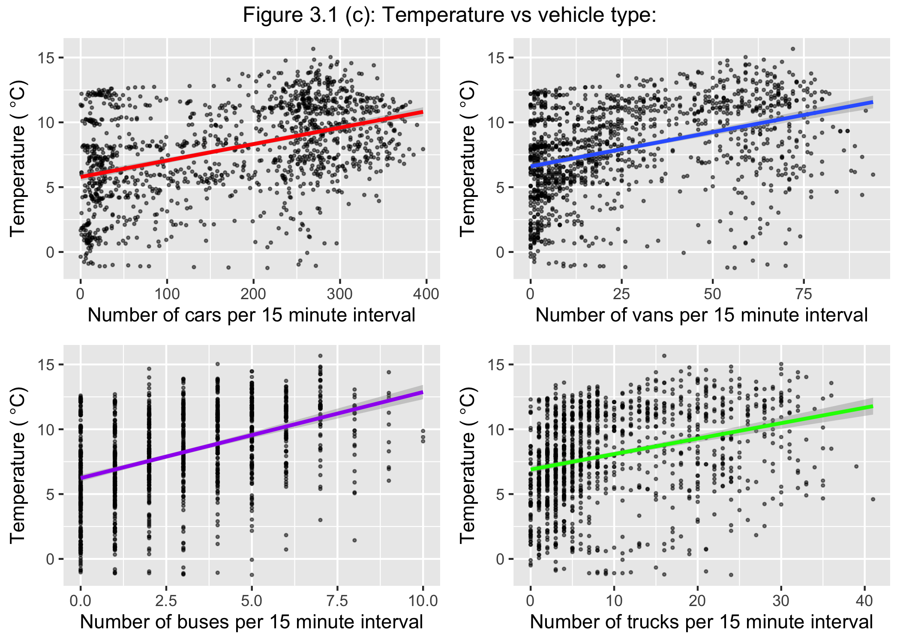
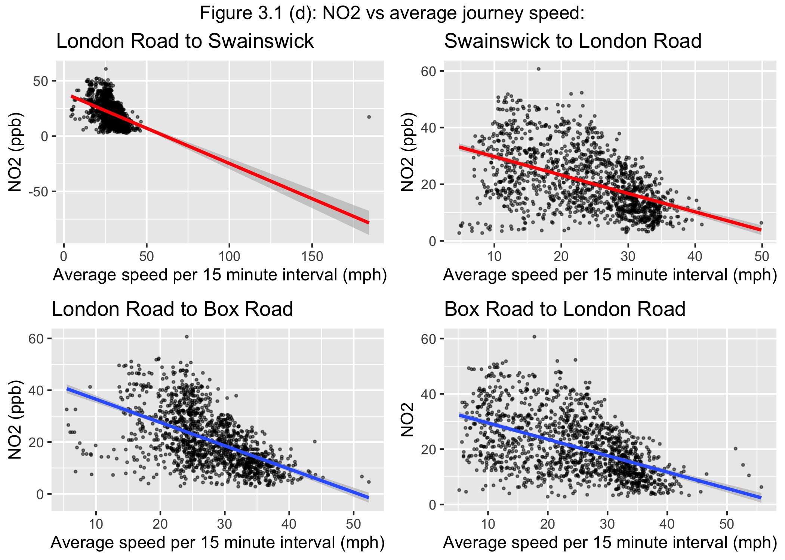
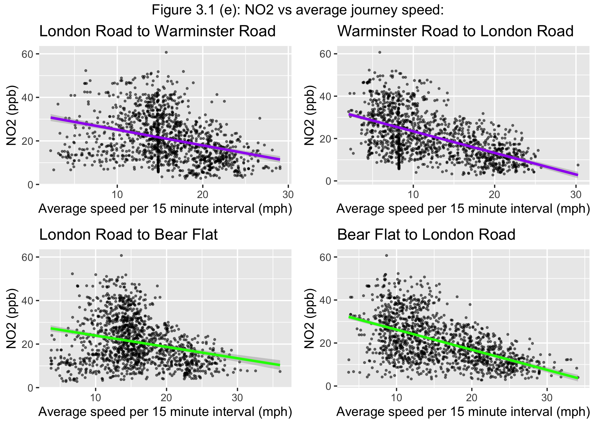
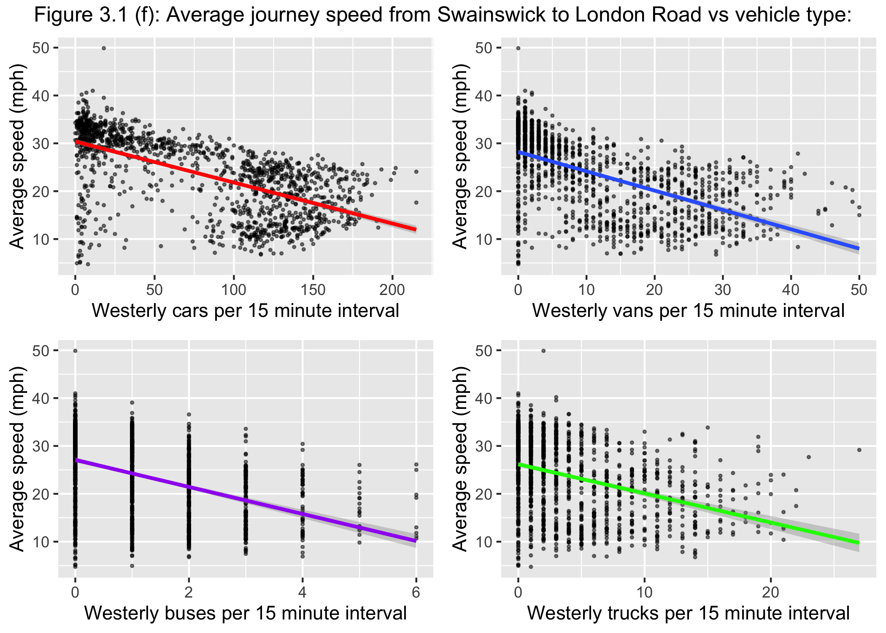
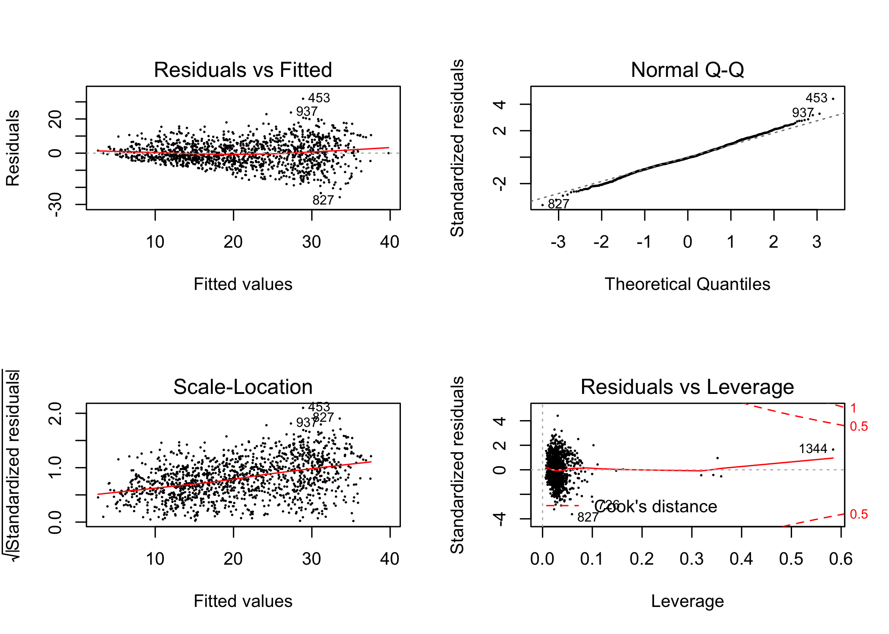
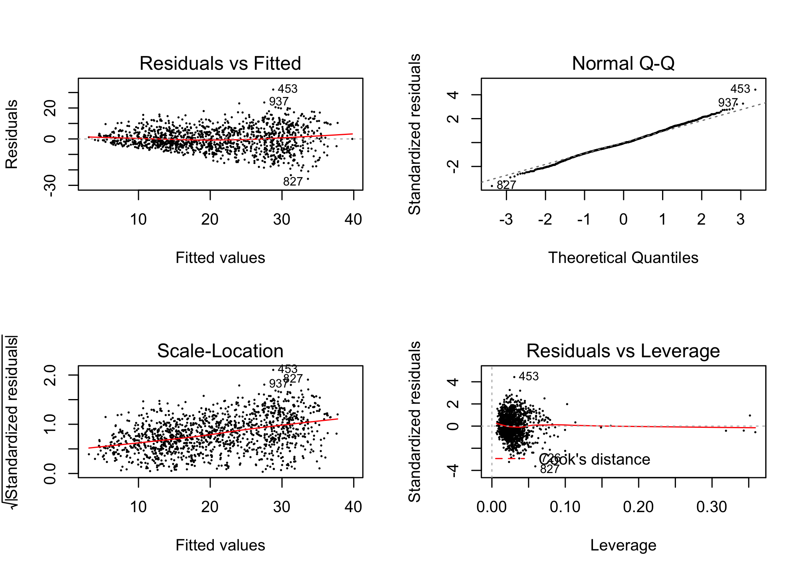
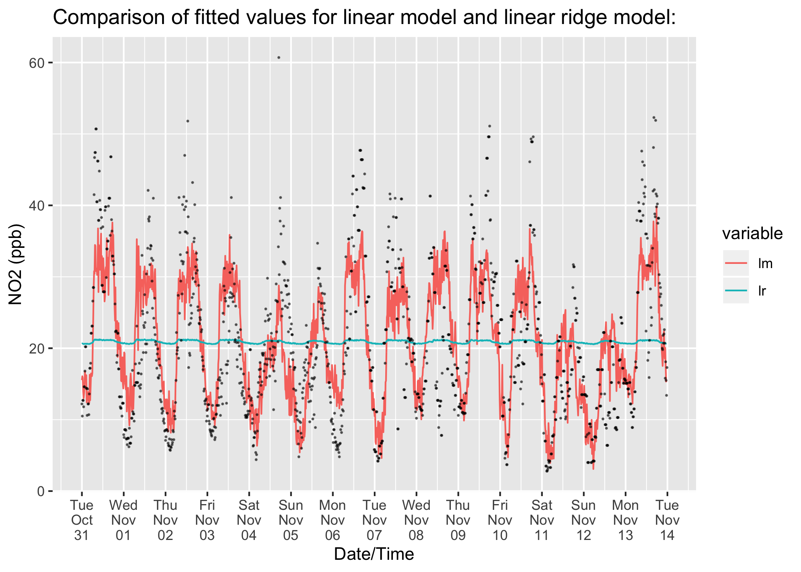

3.1 - Model data analysis & initial linear model
================

``` r
library(tidyverse)
library(ridge)
library(broom)
library(gridExtra)
library(reshape)
load('../3.0 - Model Data/LR.NO2.rda')
load('../3.0 - Model Data/LR.NO2.direction.rda')
```

In this section the data set **LR.NO2.rda** is analysed and an initial linear model of NO2 against all the traffic, weather, and average journey speed variables is fitted.

3.1.1 Model data analysis:
==========================

### Traffic counts and NO2 pollution levels:

Figure 3.1(a) shows counts of cars, vans, buses and trucks per 15 minute interval against NO2 levels, where the direction of travel has been combined.

``` r
LR.NO2 %>% mutate(
  #Adding Columns for types of vehicle:
  car = pcar_E3 + pcar_E4 + pcar_E5 + pcar_E6 + dcar_E3 + dcar_E4  + dcar_E5 + dcar_E6,
  truck = ptruck_E3 + dtruck_E3 + dtruck_E4 + dtruck_E5 + dtruck_E6,
  van = pvan_E3 + pvan_E4 + pvan_E5 + pvan_E6 + dvan_E3 + dvan_E4 + dvan_E5 + dvan_E6,
  bus = dbus_E3 + dbus_E4 + dbus_E5 + dbus_E6 ) -> LR.NO2.types

LR.NO2.types %>% ggplot(aes(x=car,y=NO2)) + geom_point(size=0.5,alpha=0.5) + geom_smooth(method='lm',col='red') + xlab("Number of cars per 15 minute interval") + ylab("NO2 (ppb)") -> car
LR.NO2.types %>% ggplot(aes(x=van,y=NO2)) + geom_point(size=0.5,alpha=0.5) + geom_smooth(method='lm') + xlab("Number of vans per 15 minute interval") + ylab("NO2 (ppb)")-> van
LR.NO2.types %>% ggplot(aes(x=bus,y=NO2)) + geom_point(size=0.5,alpha=0.5) + geom_smooth(method='lm',col='purple') + xlab("Number of buses per 15 minute interval")+ ylab("NO2 (ppb)")-> bus
LR.NO2.types %>% ggplot(aes(x=truck,y=NO2)) + geom_point(size=0.5,alpha=0.5) + geom_smooth(method='lm',col='green') + xlab("Number of trucks per 15 minute interval")+ ylab("NO2 (ppb)") -> truck
grid.arrange(car,van,bus,truck,top="Figure 3.1 (a): NO2 vs vehicle type:")
```



There is evidence of a positive linear relationship between traffic counts and NO2 pollution levels. This suggests that as vehicle counts increase, NO2 levels increase.

### Weather variables and NO2 pollution levels:

Figure 3.1(b) shows plots of air pressure, humidity, wind speed, wind direction and temperature against NO2 levels.

``` r
LR.NO2.types %>% ggplot(aes(x=pressure,y=NO2)) + geom_point(size=0.4,alpha=0.5) + geom_smooth(method='lm') + ylab("NO2 (ppb)") + xlab("Air pressure (hPa)") -> p
LR.NO2.types %>% ggplot(aes(x=humidity,y=NO2)) + geom_point(size=0.4,alpha=0.5) + geom_smooth(method='lm') + ylab("NO2 (ppb)") + xlab("Humidity (%)") -> h
LR.NO2.types %>% ggplot(aes(x=windSpeed,y=NO2)) + geom_point(size=0.4,alpha=0.5) + geom_smooth(method='lm') + ylab("NO2 (ppb)") + xlab("Wind speed (kmph)") -> ws
LR.NO2.types %>% ggplot(aes(x=windDirectionDegrees,y=NO2)) + geom_point(size=0.5,alpha=0.5) + ylab("NO2 (ppb)") + xlab("Wind direction degrees") -> wdd
LR.NO2.types %>% ggplot(aes(x=temperature,y=NO2)) + geom_point(size=0.4,alpha=0.5) + geom_smooth(method='lm')  + ylab("NO2 (ppb)") + xlab(expression("Temperature ("*~degree*C*")")) -> t
LR.NO2.types %>% ggplot(aes(x=hourlyPrecip,y=NO2)) + geom_point(size=0.4,alpha=0.5) + geom_smooth(method='lm')  + ylab("NO2 (ppb)") + xlab(expression("Precipitation (mm)")) -> precip

grid.arrange(p,h,ws,wdd,t,precip,top="Figure 3.1 (b): NO2 vs weather variables:")
```



There is evidence of the following relationships:

-   Positive linear relationships between NO2 pollution levels and air pressure, and temperature.
-   Negative linear relationships between NO2 pollution levels and humidity, wind speed, and precipitation.
-   Clusterings of points on the wind direction degrees plot, may suggest that the wind direction has a radial effect on NO2 pollution.

There is however a relationship between temperature and vehicle counts, as shown in figure 3.1 (c).

``` r
LR.NO2.types %>% ggplot(aes(x=car,y=temperature)) + geom_point(size=0.5,alpha=0.5) + geom_smooth(method='lm',col='red') + xlab("Number of cars per 15 minute interval") + ylab(expression("Temperature ("*~degree*C*")"))  -> car
LR.NO2.types %>% ggplot(aes(x=van,y=temperature)) + geom_point(size=0.5,alpha=0.5) + geom_smooth(method='lm') + xlab("Number of vans per 15 minute interval") + ylab(expression("Temperature ("*~degree*C*")")) -> van
LR.NO2.types %>% ggplot(aes(x=bus,y=temperature)) + geom_point(size=0.5,alpha=0.5) + geom_smooth(method='lm',col='purple') + xlab("Number of buses per 15 minute interval") + ylab(expression("Temperature ("*~degree*C*")")) -> bus
LR.NO2.types %>% ggplot(aes(x=truck,y=temperature)) + geom_point(size=0.5,alpha=0.5) + geom_smooth(method='lm',col='green') + xlab("Number of trucks per 15 minute interval") + ylab(expression("Temperature ("*~degree*C*")")) -> truck
grid.arrange(car,van,bus,truck,top="Figure 3.1 (c): Temperature vs vehicle type:")
```



This is not unexpected, since (as found in section 1.1) traffic counts increase during the day time and then decrease during the night time, as does the temperature (found in section 0.4). This could be problematic when modelling the effect of vehicles on NO2 levels. Hence the author has decided to remove this variable from all future modelling in this study.

### Average journey speed and NO2 pollution levels:

Figures 3.1 (d) & (c), show plots of mean average journey speeds between London Road and Swainswick/Box Road/Warminster Road/Bear Flat, per 15 minute interval, against NO2 levels.

``` r
LR.NO2.types %>% ggplot(aes(x=from_14_to_2,y=NO2)) + geom_point(size=0.5,alpha=0.5) + geom_smooth(method=lm,col='red') + ylab("NO2 (ppb)") + xlab("Average speed per 15 minute interval (mph)") + ggtitle("London Road to Swainswick") -> a
LR.NO2.types %>% ggplot(aes(x=from_2_to_14,y=NO2)) + geom_point(size=0.5,alpha=0.5) + geom_smooth(method=lm,col='red') + ylab("NO2 (ppb)") + xlab("Average speed per 15 minute interval (mph)") + ggtitle("Swainswick to London Road") -> b
LR.NO2.types %>% ggplot(aes(x=from_14_to_3,y=NO2)) + geom_point(size=0.5,alpha=0.5) + geom_smooth(method=lm) + ylab("NO2 (ppb)") + xlab("Average speed per 15 minute interval (mph)") + ggtitle("London Road to Box Road")-> c
LR.NO2.types %>% ggplot(aes(x=from_3_to_14,y=NO2)) + geom_point(size=0.5,alpha=0.5) + geom_smooth(method=lm) + xlab("Average speed per 15 minute interval (mph)") + ggtitle("Box Road to London Road") -> d
grid.arrange(a,b,c,d,top="Figure 3.1 (d): NO2 vs average journey speed:")
```



``` r
LR.NO2.types %>% ggplot(aes(x=from_14_to_15,y=NO2)) + geom_point(size=0.5,alpha=0.5) + geom_smooth(method=lm,col='purple') + ylab("NO2 (ppb)") + xlab("Average speed per 15 minute interval (mph)") + ggtitle("London Road to Warminster Road") -> e
LR.NO2.types %>% ggplot(aes(x=from_15_to_14,y=NO2)) + geom_point(size=0.5,alpha=0.5) + geom_smooth(method=lm,col='purple') + ylab("NO2 (ppb)") + xlab("Average speed per 15 minute interval (mph)") + ggtitle("Warminster Road to London Road")-> f
LR.NO2.types %>% ggplot(aes(x=from_14_to_20,y=NO2)) + geom_point(size=0.5,alpha=0.5) + geom_smooth(method=lm,col='green') + ylab("NO2 (ppb)") + xlab("Average speed per 15 minute interval (mph)") + ggtitle("London Road to Bear Flat") -> g
LR.NO2.types %>% ggplot(aes(x=from_20_to_14,y=NO2)) + geom_point(size=0.5,alpha=0.5) + geom_smooth(method=lm,col='green') + ylab("NO2 (ppb)") + xlab("Average speed per 15 minute interval (mph)") + ggtitle("Bear Flat to London Road") -> h
grid.arrange(e,f,g,h,top="Figure 3.1 (e): NO2 vs average journey speed:")
```



From these graphs, there is evidence to suggest that faster average journey speeds result in lower levels of NO2 pollution. There is a strange observation shown on the London Road to Swainswick graph, where the average journey speed per 15 minute interval is extremely fast. This observation will be discussed in the next subsection.

### Traffic counts and average journey speed:

Figure 3.1 (f), shows plots of mean average journey speeds from Swainswick to London Road against counts of vehicles travelling in the same direction through London Road per 15 minute interval (westerly travelling vehicles), for cars, vans, buses, and trucks.

``` r
LR.NO2.direction %>% mutate(
  carw = pcarw_E3 + pcarw_E4 + pcarw_E5 + pcarw_E6 + dcarw_E3 + dcarw_E4 + dcarw_E5 + dcarw_E6,
  care = pcare_E3 + pcare_E4 + pcare_E5 + pcare_E6 + dcare_E3 + dcare_E4 + dcare_E5 + dcare_E6,
  vanw = pvanw_E3 + pvanw_E4 + pvanw_E5 + pvanw_E6 + dvanw_E3 + dvanw_E4 + dvanw_E5 + dvanw_E6,
  vane = pvane_E3 + pvane_E4 + pvane_E5 + pvane_E6 + dvane_E3 + dvane_E4 + dvane_E5 + dvane_E6,
  trucke = ptrucke_E3 + dtrucke_E3 + dtrucke_E4 + dtrucke_E5 + dtrucke_E6,
  truckw = ptruckw_E3 + dtruckw_E3 + dtruckw_E4 + dtruckw_E5 + dtruckw_E6,
  buse = dbuse_E3 + dbuse_E4 + dbuse_E5 + dbuse_E6,
  busw = dbusw_E3 + dbusw_E4 + dbusw_E5 + dbusw_E6) -> LR.NO2.direction

LR.NO2.direction %>% filter(carw>0|vanw>0|truckw>0|busw>0) -> LR.NO2.direction.w

LR.NO2.direction.w %>% ggplot(aes(x=carw,y=from_2_to_14)) + geom_point(size=0.5,alpha=0.5) + geom_smooth(method='lm',col='red') + xlab("Westerly cars per 15 minute interval") + ylab("Average speed (mph)") -> car
LR.NO2.direction.w %>% ggplot(aes(x=vanw,y=from_2_to_14)) + geom_point(size=0.5,alpha=0.5) + geom_smooth(method='lm') + xlab("Westerly vans per 15 minute interval") + ylab("Average speed (mph)")-> van
LR.NO2.direction.w %>% ggplot(aes(x=busw,y=from_2_to_14)) + geom_point(size=0.5,alpha=0.5) + geom_smooth(method='lm',col='purple') + xlab("Westerly buses per 15 minute interval")+ ylab("Average speed (mph)")-> bus
LR.NO2.direction.w %>% ggplot(aes(x=truckw,y=from_2_to_14)) + geom_point(size=0.5,alpha=0.5) + geom_smooth(method='lm',col='green') + xlab("Westerly trucks per 15 minute interval")+ ylab("Average speed (mph)") -> truck
grid.arrange(car,van,bus,truck,top="Figure 3.1 (f): Average journey speed from Swainswick to London Road vs vehicle type:")
```



There is evidence to suggest that as vehicle counts increase, average journey speeds decrease. Similar observations can be made for other ANPR sites.

3.1.2 Initial linear model:
===========================

In this subsection, a linear model of NO2 against all the traffic, weather and average journey speed predictor variables, is fitted. The sine and cosine functions for the variable **windDirection** have been chosen to capture the radial affect of the wind direction on NO2 pollution levels. A better fitting model can be achieved through taking a log-transformation of the response variable **NO2**. However, it would be unnatural for traffic counts to have a multiplicative effect on NO2 levels. The author has decided to leave the response variable **NO2** untransformed in all the models in this study.

Fitting an initial linear model:

``` r
#Model formula:
formula <- NO2 ~ pcar_E3 + pcar_E4 + pcar_E5 + pcar_E6 + dcar_E3 + dcar_E4 + dcar_E5 + dcar_E6 + pvan_E3 + pvan_E4 + pvan_E5 + pvan_E6 + dvan_E3 + dvan_E4 + dvan_E5 +  dvan_E6 + dbus_E3 + dbus_E4 + dbus_E5 + dbus_E6 + ptruck_E3 + dtruck_E3 + dtruck_E4 + dtruck_E5 + dtruck_E6 + hourlyPrecip + humidity + windSpeed + pressure + cos(2*pi*windDirectionDegrees/360) + sin(2*pi*windDirectionDegrees/360) + from_14_to_15 + from_15_to_14 + from_2_to_14 + from_3_to_14 + from_14_to_2 + from_14_to_3 + from_20_to_14 + from_14_to_20

#Fit the model:
lm <- lm(formula,LR.NO2)

#Return r.squared, adj.r.squared, sigma, p.value, AIC:
glance(lm) %>% select(r.squared, adj.r.squared, sigma, p.value, AIC) %>% data.frame()
```

|  r.squared|  adj.r.squared|     sigma|  p.value|       AIC|
|----------:|--------------:|---------:|--------:|---------:|
|  0.5550368|      0.5417289|  7.328177|        0|  9209.261|

``` r
#Diagnostic Plots:

par(mfrow=c(2,2))
plot(lm,pch=20,cex = .2)
```



Row 1344 has a high leverage on the model. Examining row 1344 of of **LR.NO2** further:

``` r
LR.NO2[1344,] %>% select(DateTime,from_2_to_14,from_3_to_14,from_14_to_2,from_14_to_3,from_15_to_14,from_20_to_14,from_14_to_15,from_14_to_20) %>% data.frame()
```

|      | DateTime            |  from\_2\_to\_14|  from\_3\_to\_14|  from\_14\_to\_2|  from\_14\_to\_3|  from\_15\_to\_14|  from\_20\_to\_14|  from\_14\_to\_15|  from\_14\_to\_20|
|------|:--------------------|----------------:|----------------:|----------------:|----------------:|-----------------:|-----------------:|-----------------:|-----------------:|
| 1344 | 2017-11-13 23:45:00 |         8.865096|          15.2381|         184.3902|         19.33427|          22.36025|          25.16505|          24.82759|          5.151515|

The mean average journey speed for the 15 minute interval starting at 23:45 on 13th November for vehicles travelling from London Road to Swainswick (from\_14\_to\_2), is 184 mph. Someone must have been in a rush. This observation can be seen in figure 3.1 (d). Excluding this row and refitting the model:

``` r
#Refitting the model:
lm <- lm(formula,LR.NO2[-1344,])

#Return Estimates:
tidy(lm) %>% select(term,estimate,std.error,p.value) %>% mutate(estimate=round(estimate,5),std.error=round(std.error,5),p.value=round(p.value,5))
```

| term                                     |    estimate|  std.error|  p.value|
|:-----------------------------------------|-----------:|----------:|--------:|
| (Intercept)                              |  -235.28454|   44.48014|  0.00000|
| pcar\_E3                                 |     0.14594|    0.03955|  0.00023|
| pcar\_E4                                 |     0.03878|    0.03597|  0.28121|
| pcar\_E5                                 |    -0.02172|    0.03707|  0.55803|
| pcar\_E6                                 |    -0.06375|    0.04083|  0.11865|
| dcar\_E3                                 |     0.05183|    0.07506|  0.49002|
| dcar\_E4                                 |     0.02754|    0.04657|  0.55433|
| dcar\_E5                                 |     0.02525|    0.02665|  0.34348|
| dcar\_E6                                 |    -0.01703|    0.03555|  0.63197|
| pvan\_E3                                 |    -0.33542|    0.45712|  0.46323|
| pvan\_E4                                 |    -0.05005|    1.37872|  0.97105|
| pvan\_E5                                 |    -8.53631|    4.28038|  0.04633|
| pvan\_E6                                 |     6.19046|    7.40660|  0.40342|
| dvan\_E3                                 |    -0.17171|    0.09040|  0.05771|
| dvan\_E4                                 |    -0.00954|    0.07228|  0.89502|
| dvan\_E5                                 |     0.16755|    0.04605|  0.00028|
| dvan\_E6                                 |     0.19725|    0.09313|  0.03435|
| dbus\_E3                                 |    -1.40130|    1.58528|  0.37689|
| dbus\_E4                                 |     0.20348|    0.18405|  0.26912|
| dbus\_E5                                 |     0.06641|    0.31839|  0.83480|
| dbus\_E6                                 |     0.85973|    0.32413|  0.00809|
| ptruck\_E3                               |     0.19585|    0.48506|  0.68645|
| dtruck\_E3                               |     0.14055|    0.31490|  0.65543|
| dtruck\_E4                               |     0.39465|    0.23191|  0.08904|
| dtruck\_E5                               |    -0.21699|    0.10203|  0.03363|
| dtruck\_E6                               |    -0.00287|    0.08256|  0.97229|
| hourlyPrecip                             |     1.82143|    0.74996|  0.01529|
| humidity                                 |    -0.11866|    0.03500|  0.00072|
| windSpeed                                |    -0.44148|    0.06241|  0.00000|
| pressure                                 |     0.27000|    0.04234|  0.00000|
| cos(2 \* pi \* windDirectionDegrees/360) |    -0.60846|    0.39574|  0.12441|
| sin(2 \* pi \* windDirectionDegrees/360) |    -2.17713|    0.45653|  0.00000|
| from\_14\_to\_15                         |    -0.09651|    0.04758|  0.04273|
| from\_15\_to\_14                         |    -0.17427|    0.06032|  0.00393|
| from\_2\_to\_14                          |    -0.07130|    0.04216|  0.09107|
| from\_3\_to\_14                          |    -0.04658|    0.03546|  0.18927|
| from\_14\_to\_2                          |    -0.11632|    0.05425|  0.03220|
| from\_14\_to\_3                          |    -0.12351|    0.05209|  0.01788|
| from\_20\_to\_14                         |    -0.08943|    0.05413|  0.09872|
| from\_14\_to\_20                         |     0.00636|    0.04554|  0.88892|

``` r
#Return r.squared, adj.r.squared, sigma, p.value, AIC:
glance(lm) %>% select(r.squared, adj.r.squared, sigma, p.value, AIC)
```

|  r.squared|  adj.r.squared|    sigma|  p.value|       AIC|
|----------:|--------------:|--------:|--------:|---------:|
|  0.5559308|      0.5426394|  7.32332|        0|  9200.658|

``` r
#Diagnostic Plots:

par(mfrow=c(2,2))
plot(lm,pch=20,cex = .2)
```



Hourly precipitation is insignificant and will be omitted from all future models in this study. All of the other weather predictors are significant. There is evidence to suggest that:

-   As humidity/wind speed increase, NO2 pollution levels decrease.
-   As pressure increases, NO2 pollution levels increase.
-   The wind direction has an effect on NO2 pollution levels.

Most of the average vehicle journey speed variables are significant. Of those that are significant, there is evidence to suggest that a faster average vehicle journey speed results in lower NO2 pollution levels.

Many of the vehicle variables are statistically insignificant. Additionally we have negative estimates for some of the vehicle variables. This is counter intuitive. However, some of the vehicle variables are highly correlated, for example looking at the correlation between the different car categories:

``` r
LR.NO2 %>% select(pcar_E3,pcar_E4,pcar_E5,pcar_E6,dcar_E3,dcar_E4,dcar_E5,dcar_E6) %>% cor() %>% round(2)
```

            pcar_E3 pcar_E4 pcar_E5 pcar_E6 dcar_E3 dcar_E4 dcar_E5 dcar_E6
    pcar_E3    1.00    0.89    0.89    0.87    0.76    0.87    0.88    0.85
    pcar_E4    0.89    1.00    0.92    0.90    0.78    0.90    0.91    0.88
    pcar_E5    0.89    0.92    1.00    0.92    0.76    0.90    0.92    0.92
    pcar_E6    0.87    0.90    0.92    1.00    0.76    0.88    0.90    0.91
    dcar_E3    0.76    0.78    0.76    0.76    1.00    0.77    0.77    0.74
    dcar_E4    0.87    0.90    0.90    0.88    0.77    1.00    0.90    0.88
    dcar_E5    0.88    0.91    0.92    0.90    0.77    0.90    1.00    0.91
    dcar_E6    0.85    0.88    0.92    0.91    0.74    0.88    0.91    1.00

The author has attempted using ridge regression on this model to force all the coefficients greater than zero and to become significant. For example, setting the ridge regression parameter lambda to 500:

``` r
#Fitting linear ridge regression model:
lr <- linearRidge(formula,LR.NO2[-1344,],lambda=500)
#This function returns estimates and p-values from the linear ridge model:
look <- function(ridge.model){summary(ridge.model)$summaries$summary1$coefficients[,c(1,5)] %>% round(5) %>% data.frame() ->df; names(df)<-c("estimate","p.value"); df}
#Return estimates:
look(lr)
```

|                                          |  estimate|  p.value|
|------------------------------------------|---------:|--------:|
| (Intercept)                              |  20.02815|       NA|
| pcar\_E3                                 |   0.00089|  0.00000|
| pcar\_E4                                 |   0.00065|  0.00000|
| pcar\_E5                                 |   0.00061|  0.00000|
| pcar\_E6                                 |   0.00077|  0.00000|
| dcar\_E3                                 |   0.00212|  0.00000|
| dcar\_E4                                 |   0.00092|  0.00000|
| dcar\_E5                                 |   0.00045|  0.00000|
| dcar\_E6                                 |   0.00066|  0.00000|
| pvan\_E3                                 |   0.00932|  0.00000|
| pvan\_E4                                 |   0.00776|  0.04795|
| pvan\_E5                                 |  -0.01414|  0.25129|
| pvan\_E6                                 |   0.03733|  0.08021|
| dvan\_E3                                 |   0.00267|  0.00000|
| dvan\_E4                                 |   0.00193|  0.00000|
| dvan\_E5                                 |   0.00098|  0.00000|
| dvan\_E6                                 |   0.00254|  0.00000|
| dbus\_E3                                 |   0.00748|  0.09531|
| dbus\_E4                                 |   0.00613|  0.00000|
| dbus\_E5                                 |   0.00692|  0.00000|
| dbus\_E6                                 |   0.00677|  0.00000|
| ptruck\_E3                               |   0.00865|  0.00000|
| dtruck\_E3                               |   0.00695|  0.00000|
| dtruck\_E4                               |   0.00672|  0.00000|
| dtruck\_E5                               |   0.00254|  0.00000|
| dtruck\_E6                               |   0.00197|  0.00000|
| hourlyPrecip                             |  -0.00727|  0.00020|
| humidity                                 |  -0.00091|  0.00000|
| windSpeed                                |  -0.00035|  0.01227|
| pressure                                 |   0.00095|  0.00000|
| cos(2 \* pi \* windDirectionDegrees/360) |  -0.00210|  0.03063|
| sin(2 \* pi \* windDirectionDegrees/360) |  -0.00281|  0.01350|
| from\_14\_to\_15                         |  -0.00140|  0.00000|
| from\_15\_to\_14                         |  -0.00199|  0.00000|
| from\_2\_to\_14                          |  -0.00127|  0.00000|
| from\_3\_to\_14                          |  -0.00115|  0.00000|
| from\_14\_to\_2                          |  -0.00182|  0.00000|
| from\_14\_to\_3                          |  -0.00175|  0.00000|
| from\_20\_to\_14                         |  -0.00183|  0.00000|
| from\_14\_to\_20                         |  -0.00102|  0.00000|

Looking at a graphical comparison between this model and the linear model:

``` r
#Comparison of models
dat <- LR.NO2[-1344,]
data.frame(DateTime=dat$DateTime,lm=predict(lm),lr=predict(lr)) %>% melt(id.vars="DateTime") %>% ggplot() + geom_line(mapping=aes(y=value,x=as.POSIXct(DateTime),color=variable)) + scale_x_datetime(date_breaks = "1 day",date_labels ='%a\n%b\n%d') + xlab("Date/Time")+ylab("NO2 (ppb)") + ggtitle("Comparison of fitted values for linear model and linear ridge model:") + geom_point(LR.NO2,mapping=aes(y=NO2,x=DateTime),size=0.2,alpha=0.5)
```



Smoothing has lead to an extremely poor fit and not all the traffic predictors are significant. Ridge regression has been unsuccessful with this model. In section 3.2, variables will be linearly combined together, to assess the effect of vehicle type, fuel type, Euro emission standards, and average journey speeds on NO2 pollution levels. Section 3.3 will consider a constrained version of a model given in section 3.2.1. And section 3.4, will investigate the effect of traffic counts on average journey speeds.
