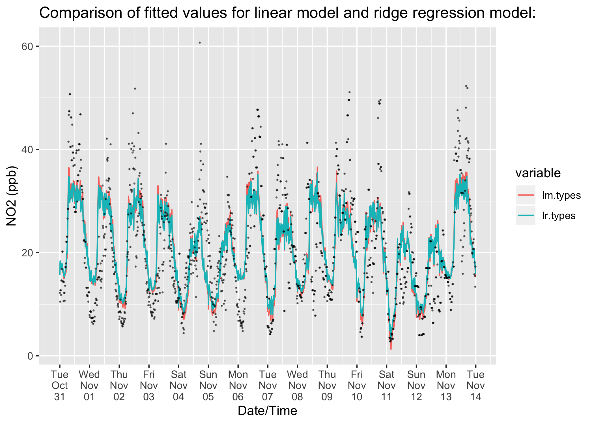
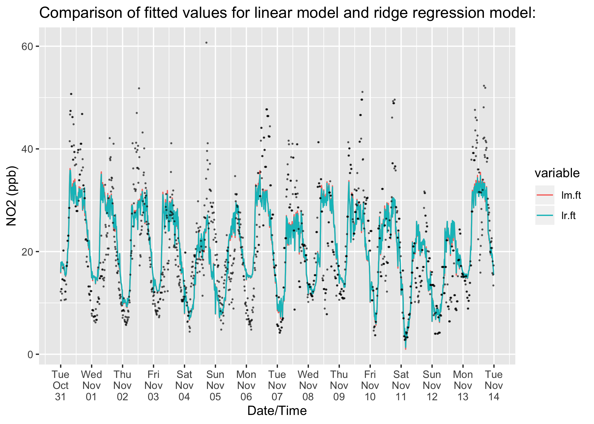
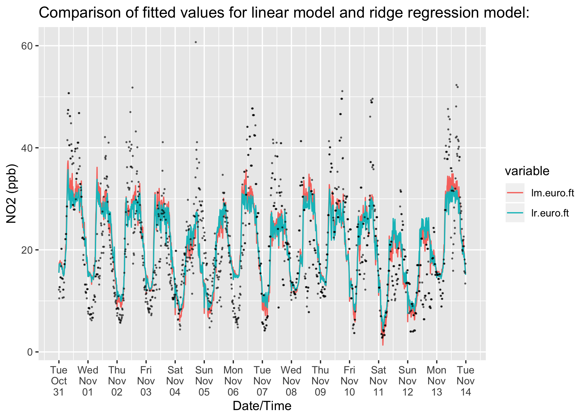

3.2 Linear & ridge regression models
================

``` r
library(tidyverse)
library(ridge)
library(broom)
library(reshape)
load('../3.0 - Model Data/LR.NO2.rda')
```

3.2.1 Effect of vehicle type on NO2 pollution levels:
=====================================================

In this subsection, the additive effect of vehicle type on NO2 levels will be explored.

``` r
#Creating data frame for model:
LR.NO2 %>% mutate(
  #Adding Columns for types of vehicle:
  car = pcar_E3 + pcar_E4 + pcar_E5 + dcar_E3 + pcar_E6 + dcar_E4  + dcar_E5 + dcar_E6,
  truck = ptruck_E3 + dtruck_E3 + dtruck_E4 + dtruck_E5 + dtruck_E6,
  van = pvan_E3 + pvan_E4 + pvan_E5 + pvan_E6 + dvan_E3 + dvan_E4 + dvan_E5 + dvan_E6,
  bus = dbus_E3 + dbus_E4 + dbus_E5 + dbus_E6 ) %>% 
  #Remove clutter:
  select(-c(pcar_E3, pcar_E4, pcar_E5, pcar_E5, pcar_E6, dcar_E3, dcar_E4, dcar_E5, dcar_E6,
            ptruck_E3, dtruck_E3, dtruck_E4, dtruck_E5, dtruck_E6,
            pvan_E3, pvan_E4, pvan_E5, pvan_E6, dvan_E3, dvan_E4, dvan_E5, dvan_E6,
            dbus_E3, dbus_E4, dbus_E5, dbus_E6 )) -> LR.NO2.types
```

Creating a linear model of NO2 against counts of petrol and diesel cars, trucks, vans & buses per 15 minute interval and weather regressors:

``` r
#Model formula:
formula <- NO2~ car + truck + van + bus + pressure + windSpeed + humidity + cos(2*pi*windDirectionDegrees/360) + sin(2*pi*windDirectionDegrees/360)
#Fit the model:
lm.types <- lm(formula,data=LR.NO2.types)
#Return Estimates:
tidy(lm.types) %>% select(term,estimate,std.error,p.value) %>% mutate(estimate=round(estimate,5),std.error=round(std.error,5),p.value=round(p.value,5))
```

| term                                     |    estimate|  std.error|  p.value|
|:-----------------------------------------|-----------:|----------:|--------:|
| (Intercept)                              |  -284.03274|   41.37361|  0.00000|
| car                                      |     0.02891|    0.00323|  0.00000|
| truck                                    |    -0.03350|    0.04800|  0.48534|
| van                                      |     0.12949|    0.02129|  0.00000|
| bus                                      |     0.47871|    0.14649|  0.00111|
| pressure                                 |     0.29895|    0.03942|  0.00000|
| windSpeed                                |    -0.48008|    0.06140|  0.00000|
| humidity                                 |    -0.09791|    0.03545|  0.00583|
| cos(2 \* pi \* windDirectionDegrees/360) |    -0.20517|    0.39897|  0.60717|
| sin(2 \* pi \* windDirectionDegrees/360) |    -1.68076|    0.45810|  0.00025|

``` r
#Return r.squared, adj.r.squared, sigma, p.value, AIC:
glance(lm.types) %>% select(r.squared, adj.r.squared, sigma, p.value, AIC)
```

|  r.squared|  adj.r.squared|    sigma|  p.value|      AIC|
|----------:|--------------:|--------:|--------:|--------:|
|  0.4976259|      0.4942366|  7.69854|        0|  9312.36|

The variable **truck** has a negative coefficient. Perhaps trucks are a lower polluting vehicle than the other classes, and an increase of the number of trucks would decrease the road capacity for other vehicles. Thus, as the number of trucks increase, there would be less cars, vans and buses in the 15 minute interval, resulting in a decrease in NO2 pollution levels. However, this feels rather unsettling. If there were no other vehicles travelling down the road at a particular time, then it would be unlikely that passing trucks would have a negative additive effect on NO2 pollution levels. In any case, the variable is statistically insignificant.

From the other estimates there is evidence for buses being the most polluting vehicle, followed by vans then cars. Considering the correlation between the different vehicle categories:

``` r
#Calculating the correlation between car, truck, van and bus counts per 15 minute interval:
LR.NO2.types %>% select(car,truck,van,bus) %>% cor() %>% round(2) %>% data.frame()
```

|       |   car|  truck|   van|   bus|
|-------|-----:|------:|-----:|-----:|
| car   |  1.00|   0.42|  0.68|  0.72|
| truck |  0.42|   1.00|  0.84|  0.56|
| van   |  0.68|   0.84|  1.00|  0.71|
| bus   |  0.72|   0.56|  0.71|  1.00|

There is a strong correlation between the predictor variables, especially between the number of vans and trucks per 15 minute interval. Multicollinearity in the linear model may be causing the variable **truck** to be negative and statistically insignificant.

To resolve the issue of multicollinearity, a linear ridge regression model will be fitted. The predictor variables have been scaled to correlation form, such that the correlation matrix has unit diagonal. The ridge regression parameter lambda has been chosen such that the truck predictor estimate has been forced greater than zero and statistically significant:

``` r
#Fitting linear ridge regression model:
lr.types <- linearRidge(formula,data=LR.NO2.types,lambda=0.15)
#This function returns estimates and p-values from the linear ridge model:
look <- function(ridge.model){summary(ridge.model)$summaries$summary1$coefficients[,c(1,5)] %>% round(5) %>% data.frame() ->df; names(df)<-c("estimate","p.value"); df}
#Returning estimates for linear ridge regression model:
look(lr.types)
```

|                                          |    estimate|  p.value|
|------------------------------------------|-----------:|--------:|
| (Intercept)                              |  -249.28800|       NA|
| car                                      |     0.02494|  0.00000|
| truck                                    |     0.05057|  0.03986|
| van                                      |     0.09431|  0.00000|
| bus                                      |     0.59706|  0.00000|
| pressure                                 |     0.26610|  0.00000|
| windSpeed                                |    -0.39952|  0.00000|
| humidity                                 |    -0.10809|  0.00004|
| cos(2 \* pi \* windDirectionDegrees/360) |    -0.08074|  0.80390|
| sin(2 \* pi \* windDirectionDegrees/360) |    -1.42312|  0.00017|

From this summary, buses have the greatest coefficient, followed by vans, trucks and cars, respectively.

Comparing the fitted values between the linear model **lm.types** and the ridge regression model **lr.types**:

``` r
#Comparison of models
data.frame(DateTime=LR.NO2$DateTime,lm.types=predict(lm.types),lr.types=predict(lr.types)) %>% melt(id.vars="DateTime") %>% ggplot() + geom_line(mapping=aes(y=value,x=as.POSIXct(DateTime),color=variable)) + scale_x_datetime(date_breaks = "1 day",date_labels ='%a\n%b\n%d') + xlab("Date/Time")+ylab("NO2 (ppb)") + ggtitle("Comparison of fitted values for linear model and ridge regression model:") + geom_point(LR.NO2,mapping=aes(y=NO2,x=DateTime),size=0.2,alpha=0.5)
```



Smoothing has only made a subtle difference to the fitted model. There is evidence that buses are the most polluting vehicle type, followed by vans, trucks, cars.

Multiplying the coefficients in the ridge regression model by the total traffic volumes for each vehicle type over the 2 week ANPR survey period, to investigate the aggregate effect of each vehicle type:

``` r
#Volumes of each vehicle type multiplied by the ridge regression coefficients:
LR.NO2.types %>% select(car,truck,van,bus) %>% apply(2,sum) * coef(lr.types)[2:5] %>% t() %>% data.frame()
```

|       car|     truck|       van|       bus|
|---------:|---------:|---------:|---------:|
|  5977.263|  657.6084|  3462.334|  2197.198|

In aggregate, there is evidence to suggest that cars contribute the most towards NO2 pollution levels, followed by vans, buses, trucks, respectively.

3.2.2 Effect of fuel type on NO2 pollution levels:
==================================================

In this subsection, the additive effect of fuel type on NO2 levels is explored.

``` r
#Creating data frame for model:
LR.NO2 %>% mutate(
  #Adding Columns for vehicle and fuels types:
  pcar = pcar_E3 + pcar_E4 + pcar_E5 + pcar_E6,
  dcar = dcar_E3 + dcar_E4 + dcar_E5 + dcar_E6,
  ptruck = ptruck_E3,
  dtruck = dtruck_E3 + dtruck_E4 + dtruck_E5 + dtruck_E6,
  pvan = pvan_E3 + pvan_E4 + pvan_E5 + pvan_E6,
  dvan = dvan_E3 + dvan_E4 + dvan_E5 + dvan_E6,
  dbus = dbus_E4 + dbus_E4 + dbus_E5 + dbus_E6, 
  
  #Adding Columns for fuels types:
  petrol = pcar + ptruck + pvan,
  diesel = dcar + dtruck + dvan +dbus) %>% 
  
  #Remove clutter:
  select(-c(pcar_E3, pcar_E4, pcar_E5, pcar_E5, pcar_E6, dcar_E3, dcar_E4, dcar_E5, dcar_E6,
            ptruck_E3, dtruck_E3, dtruck_E4, dtruck_E5, dtruck_E6,
            pvan_E3, pvan_E4, pvan_E5, pvan_E6, dvan_E3, dvan_E4, dvan_E5, dvan_E6,
            dbus_E3, dbus_E4, dbus_E5, dbus_E6 )) -> LR.NO2.types.ft
```

``` r
#Model formula:
formula.ft <- NO2~ diesel + petrol + pressure + windSpeed + humidity + cos(2*pi*windDirectionDegrees/360) + sin(2*pi*windDirectionDegrees/360)
#Fit the model:
lm.ft <- lm(formula.ft,data=LR.NO2.types.ft)
#Return Estimates:
tidy(lm.ft) %>% select(term,estimate,std.error,p.value) %>% mutate(estimate=round(estimate,4),std.error=round(std.error,4),p.value=round(p.value,4))
```

| term                                     |   estimate|  std.error|  p.value|
|:-----------------------------------------|----------:|----------:|--------:|
| (Intercept)                              |  -331.4248|    39.2839|   0.0000|
| diesel                                   |     0.0764|     0.0072|   0.0000|
| petrol                                   |     0.0067|     0.0096|   0.4840|
| pressure                                 |     0.3430|     0.0375|   0.0000|
| windSpeed                                |    -0.4538|     0.0612|   0.0000|
| humidity                                 |    -0.0777|     0.0350|   0.0266|
| cos(2 \* pi \* windDirectionDegrees/360) |    -0.4097|     0.3847|   0.2871|
| sin(2 \* pi \* windDirectionDegrees/360) |    -1.7161|     0.4608|   0.0002|

``` r
#Return r.squared, adj.r.squared, sigma, p.value, AIC:
glance(lm.ft) %>% select(r.squared, adj.r.squared, sigma, p.value, AIC)
```

|  r.squared|  adj.r.squared|     sigma|  p.value|       AIC|
|----------:|--------------:|---------:|--------:|---------:|
|  0.4887053|      0.4860264|  7.760775|        0|  9332.016|

In this simple model, the number of petrol vehicles per 15 minute interval are statistically insignificant. This may suggest that the estimate is not different from zero, and the number of petrol vehicles has no additive effect NO2 pollution levels. However, there is a strong correlation between petrol and diesel vehicles:

``` r
#Calculating the correlation between diesel and petrol vehicle counts per 15 minute interval:
LR.NO2.types.ft %>% select(diesel,petrol) %>% cor() %>% round(2) %>% data.frame()
```

|        |  diesel|  petrol|
|--------|-------:|-------:|
| diesel |    1.00|    0.93|
| petrol |    0.93|    1.00|

The variable **petrol** may be insignificant as a result of multicollinearity. Fitting a linear ridge regression model, with lambda chosen to force petrol to be significant:

``` r
#Fitting linear ridge regression model and returning estimates:
look(lr.ft<-linearRidge(formula.ft,LR.NO2.types.ft,lambda=0.016))
```

|                                          |    estimate|  p.value|
|------------------------------------------|-----------:|--------:|
| (Intercept)                              |  -333.75316|       NA|
| diesel                                   |     0.06886|  0.00000|
| petrol                                   |     0.01552|  0.04455|
| pressure                                 |     0.34537|  0.00000|
| windSpeed                                |    -0.43771|  0.00000|
| humidity                                 |    -0.07706|  0.02240|
| cos(2 \* pi \* windDirectionDegrees/360) |    -0.48867|  0.19126|
| sin(2 \* pi \* windDirectionDegrees/360) |    -1.67509|  0.00020|

The coefficient for petrol vehicles is much smaller than for diesel vehicles. This is evidence to suggest that a diesel vehicle is higher polluting a petrol vehicle.

``` r
#Comparison of models
data.frame(DateTime=LR.NO2$DateTime,lm.ft=predict(lm.ft),lr.ft=predict(lr.ft)) %>% melt(id.vars="DateTime") %>% ggplot() + geom_line(mapping=aes(y=value,x=as.POSIXct(DateTime),color=variable)) + scale_x_datetime(date_breaks = "1 day",date_labels ='%a\n%b\n%d') + xlab("Date/Time")+ylab("NO2 (ppb)") + ggtitle("Comparison of fitted values for linear model and ridge regression model:") + geom_point(LR.NO2,mapping=aes(y=NO2,x=DateTime),size=0.2,alpha=0.5)
```



The smoothing has had very little effect on the fit between the models.

Multiplying the total volumes of diesel and petrol vehicles over the two week period by the coefficients in the ridge regression model:

``` r
#Diesel and petrol vehicle volumes multiplied by the ridge regression model coefficients:
LR.NO2.types.ft %>% select(diesel,petrol) %>% apply(2,sum) * coef(lr.ft)[2:3] %>% t() %>% data.frame()
```

|    diesel|    petrol|
|---------:|---------:|
|  11766.85|  1934.191|

This is evidence that, in aggregate, the additive contribution towards NO2 pollution levels is far greater for diesel vehicles than for petrol vehicles.

3.2.3 Euro emission standards:
==============================

In this subsection, the additive effect of Euro emission standards on NO2 pollution levels is investigated.

``` r
#Creating data frame for model:
LR.NO2 %>% mutate(
  #Columns of vehicle counts according to Euro Classes:
  E3 = pcar_E3 + dcar_E3 + ptruck_E3 + dtruck_E3 + pvan_E3 + dvan_E3 + dbus_E3,
  E4 = pcar_E4 + dcar_E4 + dtruck_E4 + pvan_E4 + dvan_E4 + dbus_E4,
  E5 = pcar_E5 + dcar_E5 + dtruck_E5 + pvan_E5 + dvan_E5 + dbus_E5,
  E6 = pcar_E6 + dcar_E6 + dtruck_E6 + pvan_E6 + dvan_E6 + dbus_E6,
  
  #Columns of vehicle counts according to Euro Classes and fuel type:
  p_E3 = pcar_E3 + ptruck_E3 + pvan_E3,
  d_E3 = dcar_E3 + dtruck_E3 + dvan_E3 + dbus_E3,
  p_E4 = pcar_E4 + pvan_E4,
  d_E4 = dcar_E4 + dtruck_E4 + dvan_E4 + dbus_E4,
  p_E5 = pcar_E5 + pvan_E5,
  d_E5 = dcar_E5 + dtruck_E5 + dvan_E5 + dbus_E5,
  p_E6 = pcar_E6 + pvan_E6,
  d_E6 = dcar_E6 + dtruck_E6 + dvan_E6 + dbus_E6) -> LR.NO2.euro
```

Fitting a linear model of counts of vehicles from Euro 1-3, Euro 4, Euro 5, and Euro 6 against measured NO2 levels:

``` r
#Model formula:
formula.euro <- NO2~E3+E4+E5+E6+pressure+windSpeed+humidity+cos(2*pi*windDirectionDegrees/360)+sin(2*pi*windDirectionDegrees/360)
#Fit the model:
lm.euro <- lm(formula.euro,data=LR.NO2.euro)
#Return Estimates:
tidy(lm.euro) %>% select(term,estimate,std.error,p.value) %>% mutate(estimate=round(estimate,5),std.error=round(std.error,5),p.value=round(p.value,5))
```

| term                                     |    estimate|  std.error|  p.value|
|:-----------------------------------------|-----------:|----------:|--------:|
| (Intercept)                              |  -362.46236|   39.32143|  0.00000|
| E3                                       |     0.06002|    0.03182|  0.05950|
| E4                                       |     0.03750|    0.02412|  0.12018|
| E5                                       |     0.04954|    0.01770|  0.00520|
| E6                                       |     0.04506|    0.02217|  0.04232|
| pressure                                 |     0.37214|    0.03762|  0.00000|
| windSpeed                                |    -0.41519|    0.06258|  0.00000|
| humidity                                 |    -0.06240|    0.03508|  0.07551|
| cos(2 \* pi \* windDirectionDegrees/360) |    -0.75108|    0.38047|  0.04858|
| sin(2 \* pi \* windDirectionDegrees/360) |    -1.68407|    0.46549|  0.00031|

``` r
#Return r.squared, adj.r.squared, sigma, p.value, AIC:
glance(lm.euro) %>% select(r.squared, adj.r.squared, sigma, p.value, AIC)
```

|  r.squared|  adj.r.squared|     sigma|  p.value|       AIC|
|----------:|--------------:|---------:|--------:|---------:|
|  0.4811488|      0.4776483|  7.823772|        0|  9355.734|

Surprisingly, the variable **E4** (Euro 4 vehicles), has a smaller coefficient than the variables **E5** (Euro 5 vehicles) and **E6** (Euro 6 vehicles). However, the coefficients for Euro 1-3, Euro 4 and Euro 6 vehicles are insignificant.

Fitting a linear ridge regression model:

``` r
#Fitting linear ridge regression model and returning estimates:
look(linearRidge(formula.euro,data=LR.NO2.euro,lambda=0.01))
```

|                                          |    estimate|  p.value|
|------------------------------------------|-----------:|--------:|
| (Intercept)                              |  -360.04289|       NA|
| E3                                       |     0.06248|  0.02590|
| E4                                       |     0.03941|  0.04852|
| E5                                       |     0.04594|  0.00094|
| E6                                       |     0.04649|  0.01059|
| pressure                                 |     0.36988|  0.00000|
| windSpeed                                |    -0.40959|  0.00000|
| humidity                                 |    -0.06328|  0.06542|
| cos(2 \* pi \* windDirectionDegrees/360) |    -0.74635|  0.04672|
| sin(2 \* pi \* windDirectionDegrees/360) |    -1.66208|  0.00029|

This gives similar results to the linear model.

Considering the proportions of diesel and petrol vehicles within each Euro class:

``` r
#proportions of diesel and petrol vehicles within each Euro class:
LR.NO2.euro %>% select(d_E3,d_E4,d_E5,d_E6) %>% apply(2,sum)->d
LR.NO2.euro %>% select(p_E3,p_E4,p_E5,p_E6) %>% apply(2,sum)->p

prop <- data.frame(rbind(round(d/(d+p),3),round(p/(d+p),3)))
rownames(prop) <- c("diesel vehicles","petrol vehicles")
colnames(prop) <- c("Euro class 1-3","Euro class 4","Euro class 5","Euro class 6")
prop
```

|                 |  Euro class 1-3|  Euro class 4|  Euro class 5|  Euro class 6|
|-----------------|---------------:|-------------:|-------------:|-------------:|
| diesel vehicles |            0.36|         0.507|         0.674|          0.62|
| petrol vehicles |            0.64|         0.493|         0.326|          0.38|

Euro 5 has a much higher proportion of diesel cars and much lower proportion of petrol cars than Euro 4. This is perhaps why the coefficient for E5 is larger than E4. This observation can also be seen in Euro 6, which may additionally be the reason why the E6 coefficient is larger than Euro 4. This provides motivation to explore the extra dimension of fuel type with Euro emission standards.

3.2.4 Fuel type and Euro emission standards:
============================================

In this subsection, the model in 3.2.3 is extended, with fuel type as an extra dimension.

``` r
#Model formula:
formula.euro.ft <- NO2~p_E3+p_E4+p_E5+p_E6+d_E3+d_E4+d_E5+d_E6+pressure+windSpeed+I(cos(2*pi*windDirectionDegrees/360))+I(sin(2*pi*windDirectionDegrees/360))+humidity
#Fit the model:
lm.euro.ft <- lm(formula.euro.ft,data=LR.NO2.euro)
#Return Estimates:
tidy(lm.euro.ft) %>% select(term,estimate,std.error,p.value) %>% mutate(estimate=round(estimate,5),std.error=round(std.error,5),p.value=round(p.value,5))
```

| term                                        |    estimate|  std.error|  p.value|
|:--------------------------------------------|-----------:|----------:|--------:|
| (Intercept)                                 |  -338.73824|   39.44528|  0.00000|
| p\_E3                                       |     0.09716|    0.04056|  0.01673|
| p\_E4                                       |     0.02525|    0.03608|  0.48411|
| p\_E5                                       |    -0.03996|    0.03717|  0.28252|
| p\_E6                                       |    -0.06177|    0.04151|  0.13693|
| d\_E3                                       |     0.07386|    0.05664|  0.19240|
| d\_E4                                       |     0.11242|    0.03749|  0.00276|
| d\_E5                                       |     0.06929|    0.02196|  0.00164|
| d\_E6                                       |     0.08125|    0.02894|  0.00507|
| pressure                                    |     0.35051|    0.03769|  0.00000|
| windSpeed                                   |    -0.42302|    0.06247|  0.00000|
| I(cos(2 \* pi \* windDirectionDegrees/360)) |    -0.34630|    0.38599|  0.36980|
| I(sin(2 \* pi \* windDirectionDegrees/360)) |    -1.71393|    0.46160|  0.00021|
| humidity                                    |    -0.08551|    0.03523|  0.01536|

``` r
#Return r.squared, adj.r.squared, sigma, p.value, AIC:
glance(lm.euro.ft) %>% select(r.squared, adj.r.squared, sigma, p.value, AIC)
```

|  r.squared|  adj.r.squared|     sigma|  p.value|       AIC|
|----------:|--------------:|---------:|--------:|---------:|
|  0.4915119|      0.4865418|  7.756883|        0|  9336.618|

Petrol cars in Euro 5 and 6 have negative coefficients. There is a strong correlation between these vehicle groups:

``` r
LR.NO2.euro %>% select(p_E3,p_E4,p_E5,p_E6,d_E3,d_E4,d_E5,d_E6) %>% cor() %>% round(2) %>% data.frame()
```

|       |  p\_E3|  p\_E4|  p\_E5|  p\_E6|  d\_E3|  d\_E4|  d\_E5|  d\_E6|
|-------|------:|------:|------:|------:|------:|------:|------:|------:|
| p\_E3 |   1.00|   0.89|   0.90|   0.87|   0.81|   0.86|   0.86|   0.82|
| p\_E4 |   0.89|   1.00|   0.92|   0.91|   0.83|   0.88|   0.87|   0.84|
| p\_E5 |   0.90|   0.92|   1.00|   0.92|   0.83|   0.90|   0.91|   0.88|
| p\_E6 |   0.87|   0.91|   0.92|   1.00|   0.83|   0.89|   0.89|   0.87|
| d\_E3 |   0.81|   0.83|   0.83|   0.83|   1.00|   0.86|   0.87|   0.85|
| d\_E4 |   0.86|   0.88|   0.90|   0.89|   0.86|   1.00|   0.93|   0.91|
| d\_E5 |   0.86|   0.87|   0.91|   0.89|   0.87|   0.93|   1.00|   0.94|
| d\_E6 |   0.82|   0.84|   0.88|   0.87|   0.85|   0.91|   0.94|   1.00|

Fitting a model through linear ridge regression:

``` r
#Fitting linear ridge regression model and returning estimates:
look(lr.euro.ft<-linearRidge(formula.euro.ft,data=LR.NO2.euro,lambda=0.32))
```

|                                             |    estimate|  p.value|
|---------------------------------------------|-----------:|--------:|
| (Intercept)                                 |  -282.51613|       NA|
| p\_E3                                       |     0.06230|  0.00000|
| p\_E4                                       |     0.02660|  0.00177|
| p\_E5                                       |     0.02001|  0.00616|
| p\_E6                                       |     0.02045|  0.04262|
| d\_E3                                       |     0.10807|  0.00000|
| d\_E4                                       |     0.06806|  0.00000|
| d\_E5                                       |     0.03686|  0.00000|
| d\_E6                                       |     0.05515|  0.00000|
| pressure                                    |     0.29429|  0.00000|
| windSpeed                                   |    -0.31249|  0.00000|
| I(cos(2 \* pi \* windDirectionDegrees/360)) |    -0.46778|  0.08673|
| I(sin(2 \* pi \* windDirectionDegrees/360)) |    -1.25831|  0.00009|
| humidity                                    |    -0.06536|  0.00281|

The smoothing has had little difference on the fitted model:

``` r
#Comparison of models
data.frame(DateTime=LR.NO2$DateTime,lm.euro.ft=predict(lm.euro.ft),lr.euro.ft=predict(lr.euro.ft)) %>% melt(id.vars="DateTime") %>% ggplot() + geom_line(mapping=aes(y=value,x=as.POSIXct(DateTime),color=variable)) + scale_x_datetime(date_breaks = "1 day",date_labels ='%a\n%b\n%d') + xlab("Date/Time")+ylab("NO2 (ppb)") + ggtitle("Comparison of fitted values for linear model and ridge regression model:") + geom_point(LR.NO2,mapping=aes(y=NO2,x=DateTime),size=0.2,alpha=0.5)
```



The diesel coefficients, for each of the Euro emission standards, 1-3, 4, 5 & 6 are larger than the corresponding petrol coefficients. This is evidence to suggest that diesel vehicles are higher polluting than petrol vehicles, and supports the findings of the ridge regression model given in subsection 3.2.2.

There is a decline in the magnitude of the petrol coefficients when moving from Euro emission standards 1-3 to Euro 6, which suggests that for petrol vehicles, vehicles from Euro 1-3 are the most polluting, followed by Euro 4, Euro 5, and Euro 6, respectively.

There is a similar decrease in the magnitude for the diesel coefficients, however diesel Euro 6 has a larger coefficient than diesel Euro 5. Looking at a breakdown of proportions by vehicle type for these two groups:

``` r
#Diesel euro class 5 breakdown:
LR.NO2 %>% select(dcar_E5,dvan_E5,dtruck_E5,dbus_E5) %>% apply(2,sum) -> diesel.euro.5
(diesel.euro.5/sum(diesel.euro.5)) %>% round(3) -> euro.5.break.down
#Diesel euro class 6 breakdown:
LR.NO2 %>% select(dcar_E6,dvan_E6,dtruck_E6,dbus_E6) %>% apply(2,sum) -> diesel.euro.6
(diesel.euro.6/sum(diesel.euro.6)) %>% round(3) -> euro.6.break.down
#Table
break.down <- data.frame(rbind(euro.5.break.down,euro.6.break.down))
rownames(break.down) <- c("Diesel Euro class 5","Diesel Euro class 6")
colnames(break.down) <- c("car","van","truck","bus")
break.down
```

|                     |    car|    van|  truck|    bus|
|---------------------|------:|------:|------:|------:|
| Diesel Euro class 5 |  0.692|  0.239|  0.061|  0.008|
| Diesel Euro class 6 |  0.724|  0.126|  0.139|  0.012|

There are a higher proportion of buses, trucks and cars in Euro 6 and a lower proportion of vans than Euro 5. This might be the cause of diesel Euro 6 having larger coefficient than diesel Euro 5.

Linearly combining diesel vehicles from Euro 5 and 6 and fitting a linear ridge regression model:

``` r
#Model formula
formula.euro.ft <- NO2~p_E3+p_E4+p_E5+p_E6+d_E3+d_E4+I(d_E5+d_E6)+pressure+windSpeed+I(cos(2*pi*windDirectionDegrees/360))+I(sin(2*pi*windDirectionDegrees/360))+humidity
#Fitting linear ridge regression model and returning estimates:
look(lr.euro.ft<-linearRidge(formula.euro.ft,data=LR.NO2.euro,lambda=0.25))
```

|                                             |    estimate|  p.value|
|---------------------------------------------|-----------:|--------:|
| (Intercept)                                 |  -298.38779|       NA|
| p\_E3                                       |     0.06895|  0.00000|
| p\_E4                                       |     0.02851|  0.00439|
| p\_E5                                       |     0.02384|  0.00613|
| p\_E6                                       |     0.02369|  0.04664|
| d\_E3                                       |     0.12562|  0.00000|
| d\_E4                                       |     0.08418|  0.00000|
| I(d\_E5 + d\_E6)                            |     0.03217|  0.00000|
| pressure                                    |     0.31044|  0.00000|
| windSpeed                                   |    -0.32223|  0.00000|
| I(cos(2 \* pi \* windDirectionDegrees/360)) |    -0.52925|  0.06886|
| I(sin(2 \* pi \* windDirectionDegrees/360)) |    -1.32929|  0.00011|
| humidity                                    |    -0.07175|  0.00248|

There is evidence that for diesel vehicles, vehicles from Euro 5-6, are lowest polluting, followed by vehicles from Euro 4, Euro 1-3, respectively. All the other inferences made for the larger model remain the same for this model.

3.2.5 Charged vs exempt vehicles:
=================================

In this subsection, a simple linear model of NO2 against counts of charged (petrol and diesel vehicles which will have to pay a daily charge) and exempt (petrol and diesel vehicles which are exempt from paying a daily charge) vehicles under the current Bath CAZ policy is fitted:

``` r
LR.NO2 %>% mutate(charged = pvan_E3 + dvan_E3 + dvan_E4 + dvan_E5 + ptruck_E3 + dtruck_E3 + dtruck_E4 + dtruck_E5 + dbus_E3 + dbus_E4 + dbus_E5,
                  exempt = pcar_E3 + pcar_E4 + pcar_E5 + pcar_E6 + dcar_E3 + dcar_E4 + dcar_E5 + dcar_E6 + dtruck_E6 + dbus_E6 + pvan_E4 + pvan_E5 + pvan_E6 + dvan_E6) -> LR.NO2.charged
```

``` r
#Model formula:
formula.charged <- NO2~ charged + exempt + pressure + windSpeed + I(cos(2*pi*windDirectionDegrees/360))+I(sin(2*pi*windDirectionDegrees/360)) + humidity
#Fit the model:
lm.charged <- lm(formula.charged,data=LR.NO2.charged)
#Return Estimates:
tidy(lm.charged) %>% select(term,estimate,std.error,p.value) %>% mutate(estimate=round(estimate,5),std.error=round(std.error,5),p.value=round(p.value,5))
```

| term                                        |    estimate|  std.error|  p.value|
|:--------------------------------------------|-----------:|----------:|--------:|
| (Intercept)                                 |  -282.70520|   41.25506|  0.00000|
| charged                                     |     0.11316|    0.01238|  0.00000|
| exempt                                      |     0.03441|    0.00290|  0.00000|
| pressure                                    |     0.29789|    0.03932|  0.00000|
| windSpeed                                   |    -0.47742|    0.06146|  0.00000|
| I(cos(2 \* pi \* windDirectionDegrees/360)) |    -0.07047|    0.39625|  0.85888|
| I(sin(2 \* pi \* windDirectionDegrees/360)) |    -1.65410|    0.45929|  0.00033|
| humidity                                    |    -0.10331|    0.03548|  0.00365|

``` r
#Return r.squared, adj.r.squared, sigma, p.value, AIC:
glance(lm.charged) %>% select(r.squared, adj.r.squared, sigma, p.value, AIC)
```

|  r.squared|  adj.r.squared|     sigma|  p.value|      AIC|
|----------:|--------------:|---------:|--------:|--------:|
|  0.4921276|      0.4894666|  7.734758|        0|  9322.99|

Both variables are significant. There is evidence that a charged petrol or diesel vehicle will pollute more than an exempt petrol or diesel vehicle.

However there are many more exempt petrol and diesel vehicles than charged petrol and diesel vehicles:

``` r
#Charged and exempt vehicle counts:
LR.NO2.charged %>% select(charged,exempt) %>% apply(2,sum) %>% t() %>% data.frame()
```

|  charged|  exempt|
|--------:|-------:|
|    41120|  251895|

Considering the aggregate effect:

``` r
#Multiplying sums of charged and exempt vehicle counts by the coefficients in the linear model:
LR.NO2.charged %>% select(charged,exempt) %>% apply(2,sum) * coef(lm.charged)[2:3] %>% t() %>% data.frame()
```

|   charged|    exempt|
|---------:|---------:|
|  4653.212|  8666.471|

In aggregate, exempt petrol and diesel vehicles contribute more towards NO2 pollution levels than exempt petrol and diesel vehicles, under the current Bath CAZ policy.

3.2.6 Average journey speeds and NO2 pollution:
===============================================

This subsection will investigate the effect of average journey speeds on NO2 pollution levels. A linear model with NO2 against mean average journey speeds per 15 minute interval and with weather regressors, will be fitted. From the findings in subsection 3.1.2, row 1344 of the data will be omitted when fitting the linear model, where this caused extremely high leverage on the initial linear model. This was due to an extremely fast mean average journey speed from London Road to Swainswick of 184 mph for the 15 minute interval starting at 11:45pm on 13th November 2017.

Fitting a linear model of NO2 against mean average journey speeds per 15 minute interval and with weather regressors:

``` r
#Model formula:
formula.speed <- NO2~pressure+windSpeed+humidity+cos(2*3.14*windDirectionDegrees/360)+sin(2*3.14*windDirectionDegrees/360)+from_2_to_14+from_3_to_14+from_14_to_2+from_14_to_3+from_15_to_14+from_20_to_14+from_14_to_15+from_14_to_20
#Fit the model:
lm.speed <- lm(formula.speed,data=LR.NO2[-1344,])
#Return Estimates:
tidy(lm.speed) %>% select(term,estimate,std.error,p.value) %>% mutate(estimate=round(estimate,3),std.error=round(std.error,3),p.value=round(p.value,3)) %>% data.frame()
```

| term                                       |  estimate|  std.error|  p.value|
|:-------------------------------------------|---------:|----------:|--------:|
| (Intercept)                                |  -186.280|     38.895|    0.000|
| pressure                                   |     0.246|      0.037|    0.000|
| windSpeed                                  |    -0.460|      0.063|    0.000|
| humidity                                   |    -0.225|      0.033|    0.000|
| cos(2 \* 3.14 \* windDirectionDegrees/360) |    -1.699|      0.385|    0.000|
| sin(2 \* 3.14 \* windDirectionDegrees/360) |    -2.219|      0.477|    0.000|
| from\_2\_to\_14                            |    -0.166|      0.043|    0.000|
| from\_3\_to\_14                            |    -0.095|      0.037|    0.010|
| from\_14\_to\_2                            |    -0.118|      0.057|    0.038|
| from\_14\_to\_3                            |    -0.217|      0.054|    0.000|
| from\_15\_to\_14                           |    -0.332|      0.061|    0.000|
| from\_20\_to\_14                           |    -0.166|      0.056|    0.003|
| from\_14\_to\_15                           |    -0.106|      0.050|    0.034|
| from\_14\_to\_20                           |    -0.009|      0.048|    0.853|

``` r
#Return r.squared, adj.r.squared, sigma, p.value, AIC:
glance(lm.speed) %>% select(r.squared, adj.r.squared, sigma, p.value, AIC) %>% data.frame()
```

|  r.squared|  adj.r.squared|     sigma|  p.value|       AIC|
|----------:|--------------:|---------:|--------:|---------:|
|  0.4919242|      0.4869544|  7.756336|        0|  9329.494|

All of the average journey speed variables have negative coefficients. This suggests that an increase in average journey speed results in a decrease in NO2 pollution levels. The variable from\_14\_to 20 is insignificant. There are strong correlations between the variables:

``` r
LR.NO2 %>% select(from_2_to_14,from_3_to_14,from_14_to_2,from_14_to_3,from_15_to_14,from_14_to_15,from_20_to_14,from_14_to_20) %>% cor() %>% round(2) %>% data.frame()
```

|                  |  from\_2\_to\_14|  from\_3\_to\_14|  from\_14\_to\_2|  from\_14\_to\_3|  from\_15\_to\_14|  from\_14\_to\_15|  from\_20\_to\_14|  from\_14\_to\_20|
|------------------|----------------:|----------------:|----------------:|----------------:|-----------------:|-----------------:|-----------------:|-----------------:|
| from\_2\_to\_14  |             1.00|             0.72|             0.42|             0.58|              0.58|              0.35|              0.58|              0.41|
| from\_3\_to\_14  |             0.72|             1.00|             0.44|             0.56|              0.58|              0.40|              0.61|              0.42|
| from\_14\_to\_2  |             0.42|             0.44|             1.00|             0.59|              0.56|              0.27|              0.55|              0.17|
| from\_14\_to\_3  |             0.58|             0.56|             0.59|             1.00|              0.67|              0.32|              0.64|              0.29|
| from\_15\_to\_14 |             0.58|             0.58|             0.56|             0.67|              1.00|              0.42|              0.71|              0.29|
| from\_14\_to\_15 |             0.35|             0.40|             0.27|             0.32|              0.42|              1.00|              0.40|              0.32|
| from\_20\_to\_14 |             0.58|             0.61|             0.55|             0.64|              0.71|              0.40|              1.00|              0.37|
| from\_14\_to\_20 |             0.41|             0.42|             0.17|             0.29|              0.29|              0.32|              0.37|              1.00|

Fitting a linear ridge regression model:

``` r
#Fitting linear ridge regression model:
lr.speed <- linearRidge(formula.speed,data=LR.NO2[-1344,],lambda = 0.9)
#Return estimates:
look(lr.speed)
```

|                                            |    estimate|  p.value|
|--------------------------------------------|-----------:|--------:|
| (Intercept)                                |  -123.36147|       NA|
| pressure                                   |     0.17341|  0.00000|
| windSpeed                                  |    -0.19009|  0.00000|
| humidity                                   |    -0.11994|  0.00000|
| cos(2 \* 3.14 \* windDirectionDegrees/360) |    -0.85377|  0.00001|
| sin(2 \* 3.14 \* windDirectionDegrees/360) |    -0.84500|  0.00010|
| from\_2\_to\_14                            |    -0.11053|  0.00000|
| from\_3\_to\_14                            |    -0.09930|  0.00000|
| from\_14\_to\_2                            |    -0.16114|  0.00000|
| from\_14\_to\_3                            |    -0.16886|  0.00000|
| from\_15\_to\_14                           |    -0.20512|  0.00000|
| from\_20\_to\_14                           |    -0.16221|  0.00000|
| from\_14\_to\_15                           |    -0.11075|  0.00000|
| from\_14\_to\_20                           |    -0.04482|  0.03652|

There is evidence that average journey speeds for vehicles travelling from Warminster Road to London Road (from\_15\_to\_14) have the greatest effect on NO2 levels out of the other average journey speed variables.
