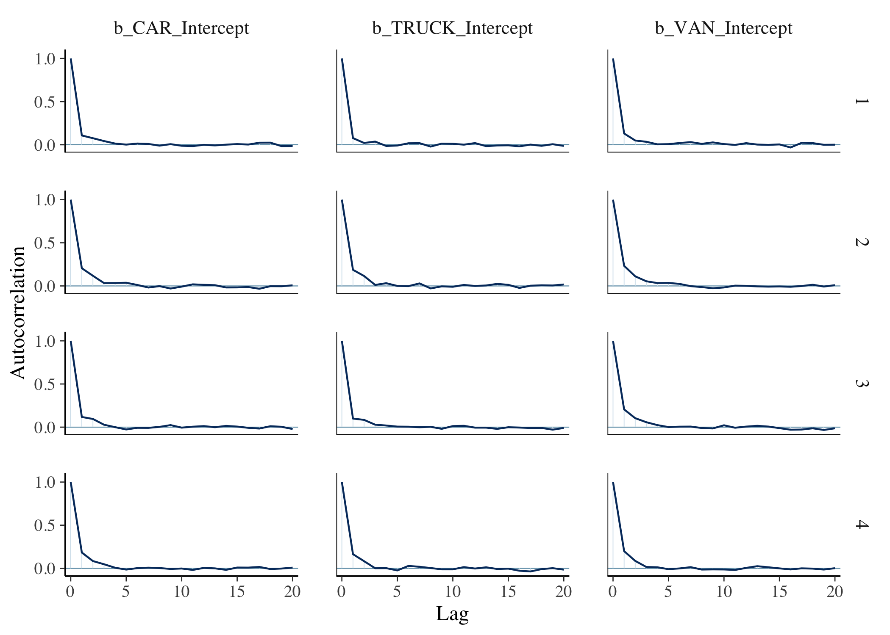
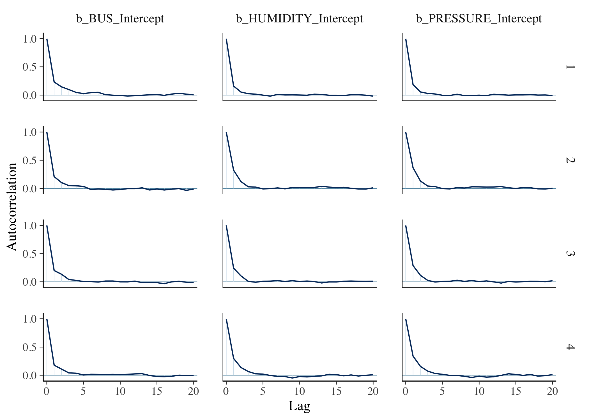
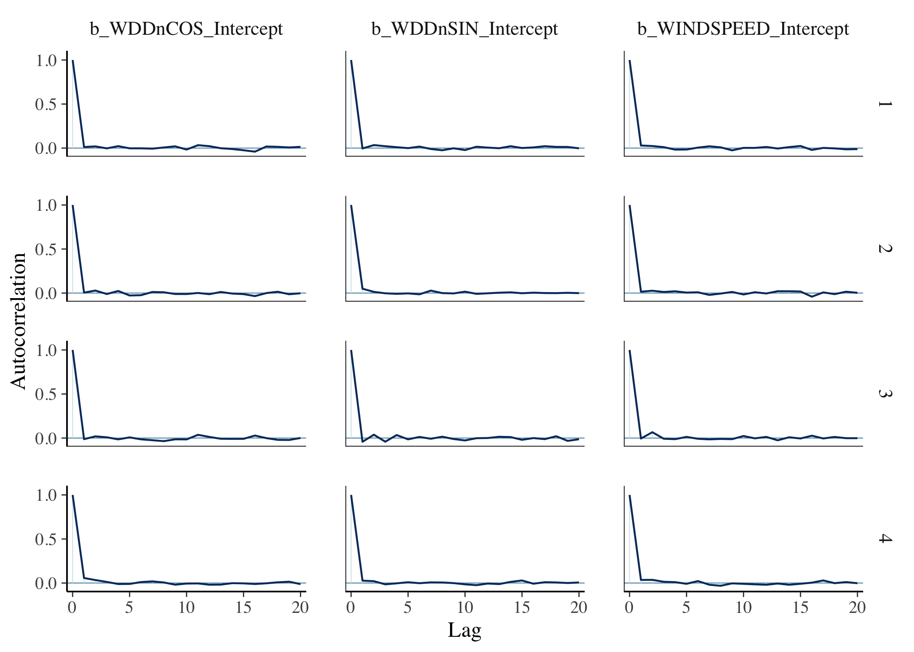
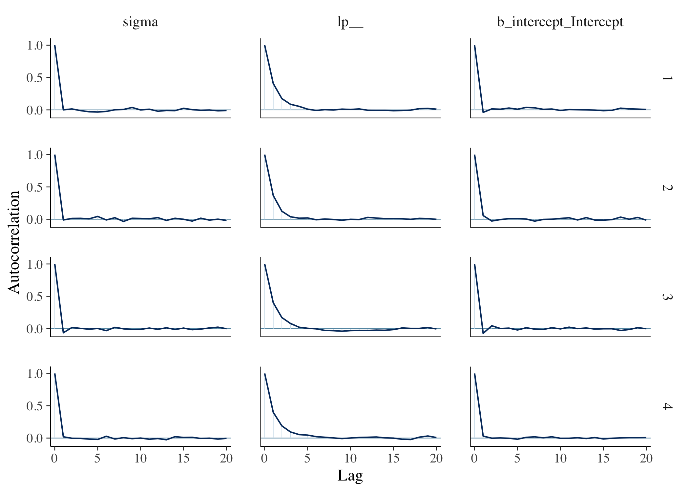
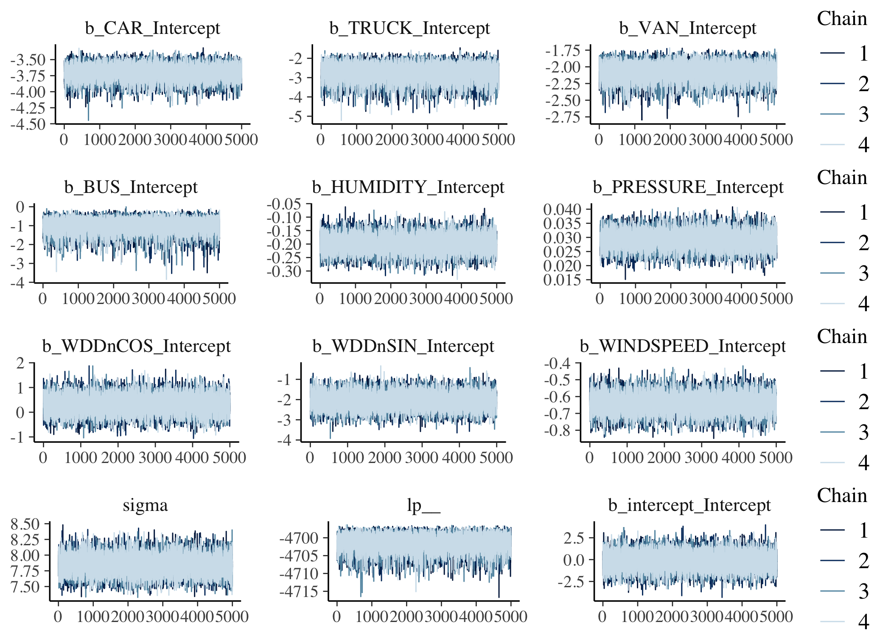
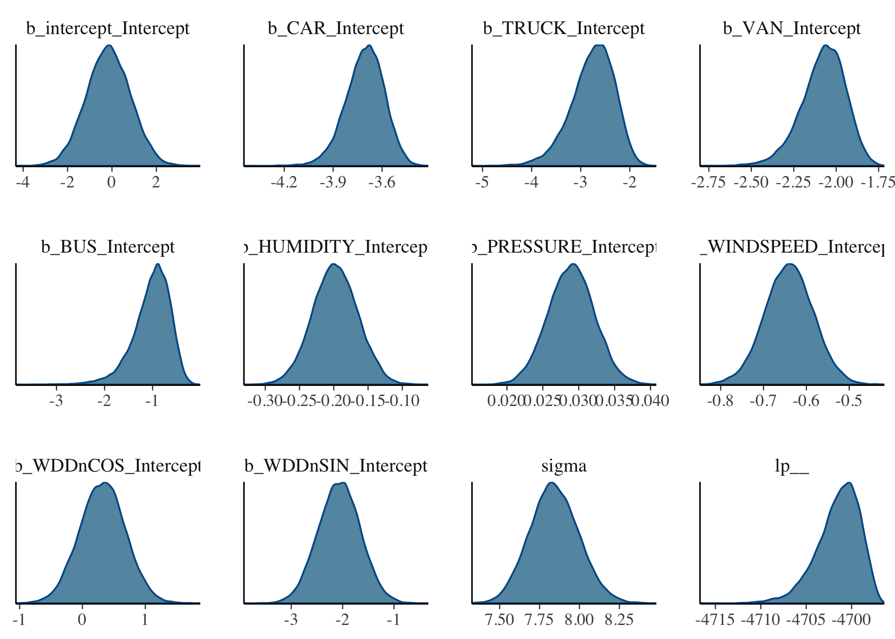

3.3 - Constrained linear model
================

``` r
library(tidyverse)
library(brms)
library(bayesplot)
library(ridge)
library(reshape2)
library(gridExtra)
load('../3.0 - Model Data/LR.NO2.rda')
load('../3.2 - Linear & Ridge Regression Models/NO2.linear.ridge.models.rda')
```

In this section, a constrained version of the model in section 3.2.1 will be considered. Log-transformations of the traffic variable parameters will be taken to force the coefficients greater than zero. Then, Markov chain Monte Carlo (MCMC) will be used to generate samples from the posterior distribution.

``` r
#Creating data frame for model:
LR.NO2 %>% mutate(
  #Adding Columns for types of vehicle:
  car = pcar_E3 + pcar_E4 + pcar_E5 + dcar_E3 + pcar_E6 + dcar_E4  + dcar_E5 + dcar_E6,
  truck = ptruck_E3 + dtruck_E3 + dtruck_E4 + dtruck_E5 + dtruck_E6,
  van = pvan_E3 + pvan_E4 + pvan_E5 + pvan_E6 + dvan_E3 + dvan_E4 + dvan_E5 + dvan_E6,
  bus = dbus_E3 + dbus_E4 + dbus_E5 + dbus_E6 ) %>% 
  #Remove clutter:
  select(-c(pcar_E3, pcar_E4, pcar_E5, pcar_E5, pcar_E6, dcar_E3, dcar_E4, dcar_E5, dcar_E6,
            ptruck_E3, dtruck_E3, dtruck_E4, dtruck_E5, dtruck_E6,
            pvan_E3, pvan_E4, pvan_E5, pvan_E6, dvan_E3, dvan_E4, dvan_E5, dvan_E6,
            dbus_E3, dbus_E4, dbus_E5, dbus_E6 )) -> LR.NO2.types
```

Using strong N(0,1) priors:

``` r
#Normal Priors:
prior <- prior(normal(0,1),nlpar="CAR") + prior(normal(0,1),nlpar="TRUCK") + prior(normal(0,1),nlpar="VAN") + prior(normal(0,1),nlpar="BUS") + prior(normal(0,1),nlpar="intercept") + prior(normal(0,1),nlpar="HUMIDITY") + prior(normal(0,1),nlpar="PRESSURE") + prior(normal(0,1),nlpar="WINDSPEED") + prior(normal(0,1),nlpar="WDDnCOS") + prior(normal(0,1),nlpar="WDDnSIN")
```

Now running the simulations for four Markov chains, each with a total number iterations of 10,000. By default there is a warm-up of half the number of iterations for each chain:

``` r
cl.types <- brm(bf(NO2~intercept+exp(CAR)*car+exp(TRUCK)*truck+exp(VAN)*van+exp(BUS)*bus+HUMIDITY*humidity+PRESSURE*pressure+WINDSPEED*windSpeed+WDDnCOS*(cos(2*3.1415*windDirectionDegrees/360))+WDDnSIN*(sin(2*3.1415*windDirectionDegrees/360)),intercept+CAR+TRUCK+VAN+BUS+HUMIDITY+PRESSURE+WINDSPEED+WDDnCOS+WDDnSIN~1,nl=TRUE),data=LR.NO2.types,prior = prior,chains=4,iter=10000,algorithm = "sampling",cores=4)

save(cl.types,file="cl.types.rda")
```

Looking at diagnostics:

``` r
#ACF plots:
mcmc_acf(cl.types,pars = c("b_CAR_Intercept","b_TRUCK_Intercept","b_VAN_Intercept"))
```



``` r
mcmc_acf(cl.types,pars = c("b_BUS_Intercept","b_HUMIDITY_Intercept","b_PRESSURE_Intercept"))
```



``` r
mcmc_acf(cl.types,pars =c("b_WDDnCOS_Intercept","b_WDDnSIN_Intercept","b_WINDSPEED_Intercept"))
```



``` r
mcmc_acf(cl.types,pars=c("sigma","lp__","b_intercept_Intercept"))
```



``` r
#Trace plots:
grid.arrange(
mcmc_trace(cl.types,pars = c("b_CAR_Intercept","b_TRUCK_Intercept","b_VAN_Intercept")),
mcmc_trace(cl.types,pars = c("b_BUS_Intercept","b_HUMIDITY_Intercept","b_PRESSURE_Intercept")),
mcmc_trace(cl.types,pars =c("b_WDDnCOS_Intercept","b_WDDnSIN_Intercept","b_WINDSPEED_Intercept")),
mcmc_trace(cl.types,pars=c("sigma","lp__","b_intercept_Intercept")),nrow=4)
```



The ACF plots decay quickly, and suggest that each of the four chains have reached their stationary distribution.

Looking the univariate densities for each of the parameters and taking a a robust posterior summary (the median is used as the measure of central tendency and the median absolute deviation (MAD) as the measure of variability).

``` r
mcmc_dens(cl.types)
```



``` r
posterior_summary(cl.types,robust=T) %>% round(5) %>% data.frame()
```

|                         |     Estimate|  Est.Error|         Q2.5|        Q97.5|
|-------------------------|------------:|----------:|------------:|------------:|
| b\_intercept\_Intercept |     -0.15909|    0.99457|     -2.11624|      1.76852|
| b\_CAR\_Intercept       |     -3.69992|    0.11524|     -3.95600|     -3.49253|
| b\_TRUCK\_Intercept     |     -2.71694|    0.42812|     -3.73289|     -2.02510|
| b\_VAN\_Intercept       |     -2.06578|    0.12556|     -2.36062|     -1.85192|
| b\_BUS\_Intercept       |     -0.96813|    0.35181|     -1.94862|     -0.42747|
| b\_HUMIDITY\_Intercept  |     -0.19804|    0.03294|     -0.26241|     -0.13360|
| b\_PRESSURE\_Intercept  |      0.02898|    0.00322|      0.02264|      0.03530|
| b\_WINDSPEED\_Intercept |     -0.64019|    0.05602|     -0.75295|     -0.52923|
| b\_WDDnCOS\_Intercept   |      0.32108|    0.36291|     -0.39174|      1.02891|
| b\_WDDnSIN\_Intercept   |     -2.06301|    0.41190|     -2.86816|     -1.26714|
| sigma                   |      7.84006|    0.15260|      7.55235|      8.15227|
| lp\_\_                  |  -4701.16019|    2.25375|  -4706.95202|  -4697.79852|

Undoing the log-transform of the traffic predictor estimates by taking the exponent:

``` r
posterior_summary(cl.types,robust=T)[2:5,1] %>% exp() %>% t() %>% data.frame() -> estimates
names(estimates) <- c("car","truck","van","bus")
estimates
```

|        car|      truck|        van|       bus|
|----------:|----------:|----------:|---------:|
|  0.0247254|  0.0660764|  0.1267196|  0.379791|

This is evidence that buses are the most polluting type of vehicle, followed by vans, trucks and cars, respectively. This is evidence to support the findings given by the ridge regression model in 3.2.1.

``` r
LR.NO2.types %>% select(car,truck,van,bus) %>% apply(2,sum) * estimates  %>% data.frame()
```

|       car|     truck|       van|       bus|
|---------:|---------:|---------:|---------:|
|  5924.655|  859.1912|  4652.382|  1397.631|

In aggregate, cars contribute the most towards NO2 pollution levels.

Graphical comparison to the linear model and ridge regression model in section 3.2.1:

``` r
#Comparison to linear model in section 3.2.1:

data.frame(DateTime=LR.NO2$DateTime,lm.types=predict(lm.types),lr.types=predict(lr.types),cl.types=predict(cl.types)[,1]) %>% melt(id.vars="DateTime") %>% ggplot() + geom_line(mapping=aes(y=value,x=as.POSIXct(DateTime),color=variable),size=0.5,alpha=1) + scale_x_datetime(date_breaks = "1 day",date_labels ='%a\n%b\n%d') + xlab("Date/Time")+ylab("NO2 (ppb)") + ggtitle("Comparison: linear model, ridge regression model & constrained linear model") + geom_point(LR.NO2,mapping=aes(y=NO2,x=DateTime),size=0.3,alpha=0.6) + labs(color="Model")
```


