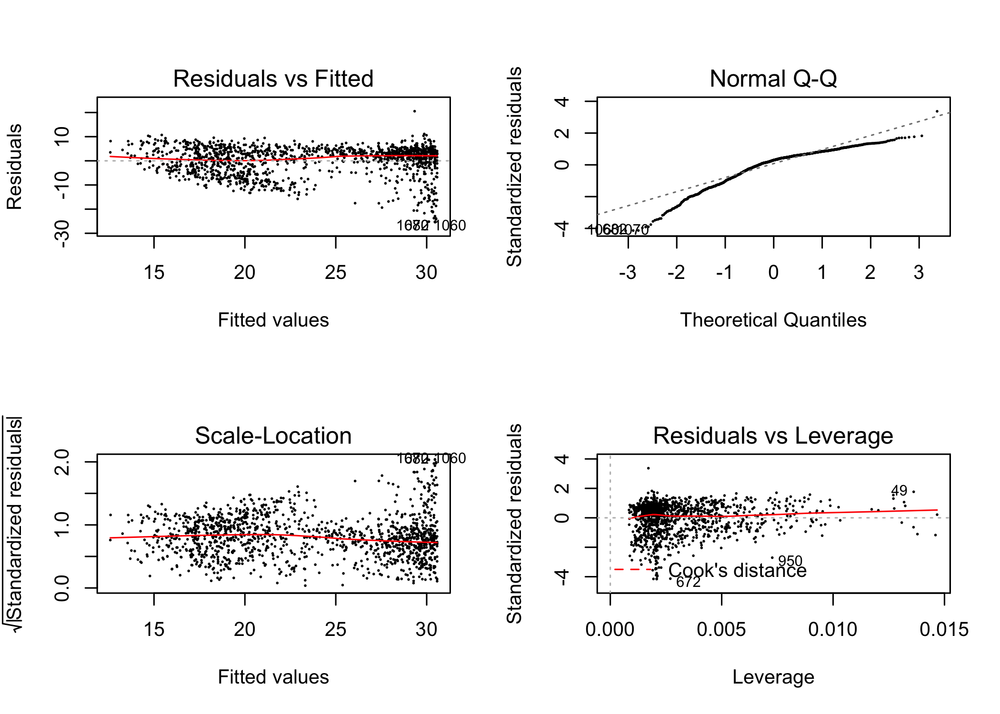
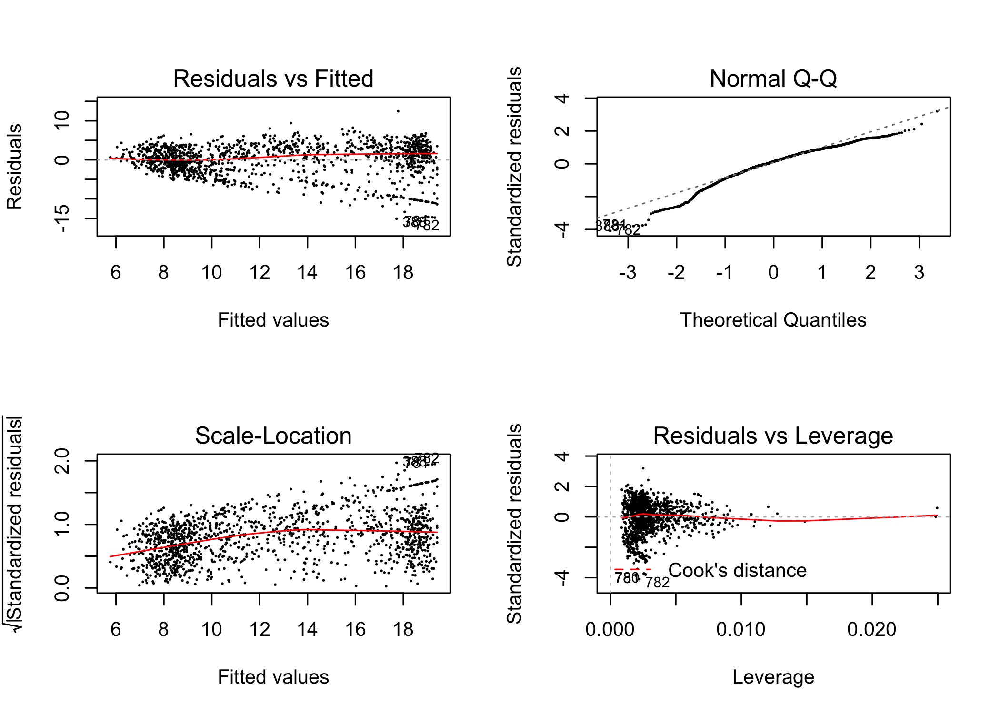

3.4 - Traffic volumes & average journey speeds
================

``` r
library(tidyverse)
library(ridge)
library(broom)
library(gridExtra)
load('../3.0 - Model Data/LR.NO2.direction.rda')
```

In this section, the additive effect of traffic volumes on congestion is investigated.

3.4.1 - Vehicle type and average journey speed:
===============================================

In this subsection, the additive affect of vehicle type on congestion is explored. Two linear models will be fitted; one with average journey speeds for vehicles travelling from Swainswick to London Road as the response variable, the other one with average journey speeds for vehicles travelling from Warminster Road to London road as the response variable. The average journey speeds will be modelled against traffic counts per 15 minute interval at the London Road site for traffic flowing in the same direction (easterly for Warminster Road to London Road and westerly for Swainswick to London Road). Similar results can be obtained for linear models with each of the other average journey speed variables from **LR.NO2.direction.rda**, as the response variable.

``` r
LR.NO2.direction %>% mutate(
  carw = pcarw_E3 + pcarw_E4 + pcarw_E5 + pcarw_E6 + dcarw_E3 + dcarw_E4 + dcarw_E5 + dcarw_E6,
  care = pcare_E3 + pcare_E4 + pcare_E5 + pcare_E6 + dcare_E3 + dcare_E4 + dcare_E5 + dcare_E6,
  vanw = pvanw_E3 + pvanw_E4 + pvanw_E5 + pvanw_E6 + dvanw_E3 + dvanw_E4 + dvanw_E5 + dvanw_E6,
  vane = pvane_E3 + pvane_E4 + pvane_E5 + pvane_E6 + dvane_E3 + dvane_E4 + dvane_E5 + dvane_E6,
  trucke = ptrucke_E3 + dtrucke_E3 + dtrucke_E4 + dtrucke_E5 + dtrucke_E6,
  truckw = ptruckw_E3 + dtruckw_E3 + dtruckw_E4 + dtruckw_E5 + dtruckw_E6,
  buse = dbuse_E3 + dbuse_E4 + dbuse_E5 + dbuse_E6,
  busw = dbusw_E3 + dbusw_E4 + dbusw_E5 + dbusw_E6) -> LR.NO2.direction
```

The author will remove rows in the data where the traffic counts were zero for all vehicle types for a 15 minute interval, since these values were interpolated and would be unnatural for our modelling purposes:

``` r
#Removing data points where traffic counts were zero for all vehicle types for a 15 minute interval:
LR.NO2.direction %>% filter(carw>0|vanw>0|truckw>0|busw>0) -> LR.NO2.direction.w
LR.NO2.direction %>% filter(care>0|vane>0|trucke>0|buse>0) -> LR.NO2.direction.e
```

Trucks and vans have been linearly combined and will be interpreted as industrial vehicles, fitting both models:

``` r
#Swainswick to London Road
formula.from_2_to_14 <- from_2_to_14~carw+I(vanw+truckw)+busw
lm.from_2_to_14 <- lm(formula.from_2_to_14,data=LR.NO2.direction.w)

#Warminster Road to London Road:
formula.from_15_to_14 <- from_15_to_14~care+I(vane+trucke)+buse
lm.from_15_to_14 <- lm(formula.from_15_to_14,data=LR.NO2.direction.e)

#Return r.squared, adj.r.squared, sigma, p.value, AIC:
num_diag<- function(model,name){glance(model) %>% mutate(model=name) %>% select(model,r.squared, adj.r.squared, sigma, p.value, AIC)}

data.frame(rbind(num_diag(lm.from_2_to_14,"lm.from_2_to_14"),
num_diag(lm.from_15_to_14,"lm.from_15_to_14")))
```

| model               |  r.squared|  adj.r.squared|     sigma|  p.value|       AIC|
|:--------------------|----------:|--------------:|---------:|--------:|---------:|
| lm.from\_2\_to\_14  |  0.4207976|      0.4194921|  6.100637|        0|  8622.970|
| lm.from\_15\_to\_14 |  0.5451324|      0.5440915|  3.902575|        0|  7318.907|

``` r
#Diagnostic plots: Swainswick to London Road
par(mfrow=c(2,2))
plot(lm.from_2_to_14,pch=20,cex = .2)
```



``` r
#Diagnostic plots: Warminster to London Road
par(mfrow=c(2,2))
plot(lm.from_15_to_14,pch=20,cex = .2)
```



The models diagnostics look okay. Returning the estimates:

``` r
#Return Estimates function:
return_estimates <- function(model,dp,name){tidy(model) %>% mutate(model=name) %>% select(model,term,estimate,std.error,p.value) %>% mutate(estimate=round(estimate,dp), std.error=round(std.error,dp),p.value=round(p.value,dp))}

#Return Estimates:
data.frame(rbind(return_estimates(lm.from_2_to_14,3,"lm.from_2_to_14"),
return_estimates(lm.from_15_to_14,3,"lm.from_15_to_14")))
```

| model               | term             |  estimate|  std.error|  p.value|
|:--------------------|:-----------------|---------:|----------:|--------:|
| lm.from\_2\_to\_14  | (Intercept)      |    30.634|      0.284|    0.000|
| lm.from\_2\_to\_14  | carw             |    -0.059|      0.004|    0.000|
| lm.from\_2\_to\_14  | I(vanw + truckw) |    -0.114|      0.015|    0.000|
| lm.from\_2\_to\_14  | busw             |    -0.451|      0.168|    0.007|
| lm.from\_15\_to\_14 | (Intercept)      |    19.458|      0.206|    0.000|
| lm.from\_15\_to\_14 | care             |    -0.046|      0.002|    0.000|
| lm.from\_15\_to\_14 | I(vane + trucke) |    -0.075|      0.007|    0.000|
| lm.from\_15\_to\_14 | buse             |    -0.378|      0.098|    0.000|

All the estimates are significant. We see that for both models, a petrol or diesel bus has the greatest impact on reducing average journey speeds from Swainswick to London Road, and from Warminster Road to London Road, then a petrol or diesel industrial vehicle, then a petrol or diesel car.

However, for non empty road intervals, for both directions:

``` r
LR.NO2.direction.w %>% mutate(industrialw = vanw+truckw) -> LR.NO2.direction.w
LR.NO2.direction.e %>% mutate(industriale = vane+trucke) -> LR.NO2.direction.e
LR.NO2.direction.w %>% select(carw,industrialw,busw) %>% apply(2,mean) -> w
LR.NO2.direction.e %>% select(care,industriale,buse) %>% apply(2,mean) -> e
tbl <- rbind(w,e); rownames(tbl) <- c("west","east")
colnames(tbl) <- c("car","industrial","bus")
data.frame(tbl)
```

|      |        car|  industrial|       bus|
|------|----------:|-----------:|---------:|
| west |   79.04345|    15.57154|  1.232210|
| east |  101.97338|    21.99924|  1.547529|

The average number of petrol and diesel cars for a non-empty 15 minute interval, is much higher than the other vehicle classes.

Considering the aggregate effect of each vehicle type on average journey speed:

``` r
#Multiplying average number of vehicles for each vehicle type in a non-empty 15 minute interval by the corresponding coefficient in the linear model:
agg <- data.frame(rbind(coefficients(lm.from_2_to_14)[2:4] * w,
coefficients(lm.from_15_to_14)[2:4] * e))
rownames(agg) <- c("lm.from_2_to_14","lm.from_15_to_14"); 
colnames(agg) <- c("cars   ","trucks & vans","buses")
agg
```

|                     |    cars   |  trucks & vans|       buses|
|---------------------|:---------:|--------------:|-----------:|
| lm.from\_2\_to\_14  | -4.693642 |      -1.777185|  -0.5563218|
| lm.from\_15\_to\_14 | -4.681183 |      -1.643110|  -0.5847827|

There is evidence, that in aggregate, petrol and diesel cars contribute the most towards congestion, then petrol and diesel industrial vehicles, then petrol and diesel buses.

3.4.2 Charged vs exempt vehicles, and average journey speed:
============================================================

This subsection will investigate, the additive affect of charged and exempt petrol and diesel vehicles, under the current Bath CAZ policy, on congestion. Two linear models will be fitted; one with average journey speeds for vehicles travelling from Swainswick to London Road as the response variable, the other one with average journey speeds for vehicles travelling from Warminster Road to London road as the response variable. The average journey speeds will be modelled against traffic counts of charged and exempt petrol and diesel vehicles per 15 minute interval at the London Road site for traffic flowing in the same direction (easterly for Warminster Road to London Road and westerly for Swainswick to London Road). Similar results can be obtained for linear models with each of the other average journey speed variables from **LR.NO2.direction.rda**, as the response variable.

``` r
LR.NO2.direction %>% mutate(
  charged_east = pvane_E3 + dvane_E3 + dvane_E4 + dvane_E5 + ptrucke_E3 + dtrucke_E3 + dtrucke_E4 + dtrucke_E5 + dbuse_E3 + dbuse_E4 + dbuse_E5,
  
  exempt_east = pcare_E3 + pcare_E4 + pcare_E5 + pcare_E6 + dcare_E3 + dcare_E4 + dcare_E5 + dcare_E6 + dtrucke_E6 + dbuse_E6 + pvane_E4 + pvane_E5 + pvane_E6 + dvane_E6,
  
  charged_west = pvanw_E3 + dvanw_E3 + dvanw_E4 + dvanw_E5 + ptruckw_E3 + dtruckw_E3 + dtruckw_E4 + dtruckw_E5 + dbusw_E3 + dbusw_E4 + dbusw_E5,
  
  exempt_west = pcarw_E3 + pcarw_E4 + pcarw_E5 + pcarw_E6 + dcarw_E3 + dcarw_E4 + dcarw_E5 + dcarw_E6 + dtruckw_E6 + dbusw_E6 + pvanw_E4 + pvanw_E5 + pvanw_E6 + dvanw_E6) -> LR.NO2.direction

#Removing data points where traffic counts were zero for both charged and exempt vehicles for a 15 minute interval:
LR.NO2.direction %>% filter(charged_east>0|exempt_east>0) -> LR.NO2.direction.charged.e
LR.NO2.direction %>% filter(charged_west>0|exempt_west>0) -> LR.NO2.direction.charged.w

#Swainswick to London Road:
formula.charged.from_2_to_14 <- from_2_to_14 ~ charged_west + exempt_west
lm.charged.from_2_to_14 <- lm(formula.charged.from_2_to_14,data=LR.NO2.direction.charged.w)

#Warminster Road to London Road:
formula.charged.from_15_to_14 <- from_15_to_14 ~ charged_east + exempt_east
lm.charged.from_15_to_14 <- lm(formula.charged.from_15_to_14,data=LR.NO2.direction.charged.e)

#Return r.squared, adj.r.squared, sigma, p.value, AIC:
data.frame(rbind(num_diag(lm.charged.from_2_to_14,"lm.charged.from_2_to_14"),
num_diag(lm.charged.from_15_to_14,"lm.charged.from_15_to_14")))
```

| model                       |  r.squared|  adj.r.squared|     sigma|  p.value|       AIC|
|:----------------------------|----------:|--------------:|---------:|--------:|---------:|
| lm.charged.from\_2\_to\_14  |  0.4213465|      0.4204777|  6.095456|        0|  8619.704|
| lm.charged.from\_15\_to\_14 |  0.5413049|      0.5406057|  3.917466|        0|  7327.925|

``` r
#Return Estimates:
data.frame(coef<- rbind(return_estimates(lm.charged.from_2_to_14,3,"lm.charged.from_2_to_14"),
return_estimates(lm.charged.from_15_to_14,3,"lm.charged.from_15_to_14")))
```

| model                       | term          |  estimate|  std.error|  p.value|
|:----------------------------|:--------------|---------:|----------:|--------:|
| lm.charged.from\_2\_to\_14  | (Intercept)   |    30.535|      0.284|        0|
| lm.charged.from\_2\_to\_14  | charged\_west |    -0.158|      0.019|        0|
| lm.charged.from\_2\_to\_14  | exempt\_west  |    -0.059|      0.004|        0|
| lm.charged.from\_15\_to\_14 | (Intercept)   |    19.413|      0.207|        0|
| lm.charged.from\_15\_to\_14 | charged\_east |    -0.092|      0.009|        0|
| lm.charged.from\_15\_to\_14 | exempt\_east  |    -0.048|      0.002|        0|

For both models, a charged petrol or diesel vehicle will reduce the average journey speed more than an exempt petrol or diesel vehicle. However considering the aggregate effect:

``` r
LR.NO2.direction.charged.e %>% select(charged_east,exempt_east) %>% apply(2,sum) -> c.e
LR.NO2.direction.charged.w %>% select(charged_west,exempt_west) %>% apply(2,sum) -> c.w

aggregrate_effect <- data.frame(rbind(
  coefficients(lm.charged.from_2_to_14)[2:3] * c.w,
  coefficients(lm.charged.from_15_to_14)[2:3] * c.e))

rownames(aggregrate_effect) <- c("lm.charged.from_2_to_14", "lm.charged.from_15_to_14")
colnames(aggregrate_effect) <- c("charged vehicles","exempt vehicles")
aggregrate_effect
```

|                             |  charged vehicles|  exempt vehicles|
|-----------------------------|-----------------:|----------------:|
| lm.charged.from\_2\_to\_14  |         -2712.025|        -6536.767|
| lm.charged.from\_15\_to\_14 |         -2203.232|        -6822.457|

We find that exempt petrol and diesel vehicles in aggregate, under the current CAZ policy will contribute more towards congestion than charged petrol and diesel vehicles.
