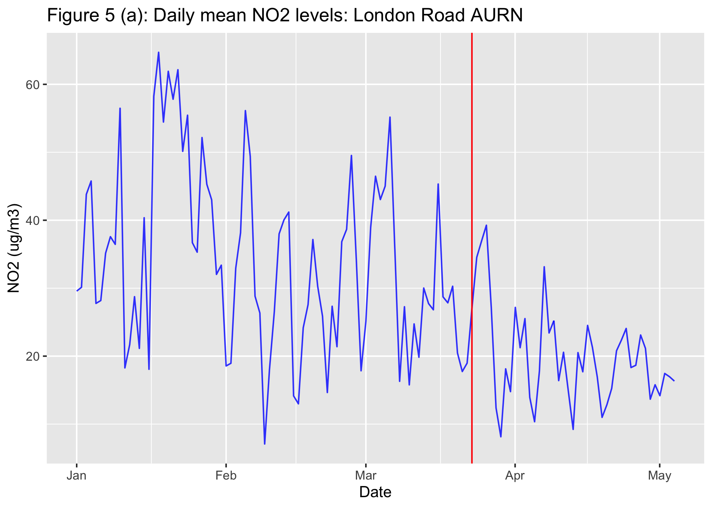
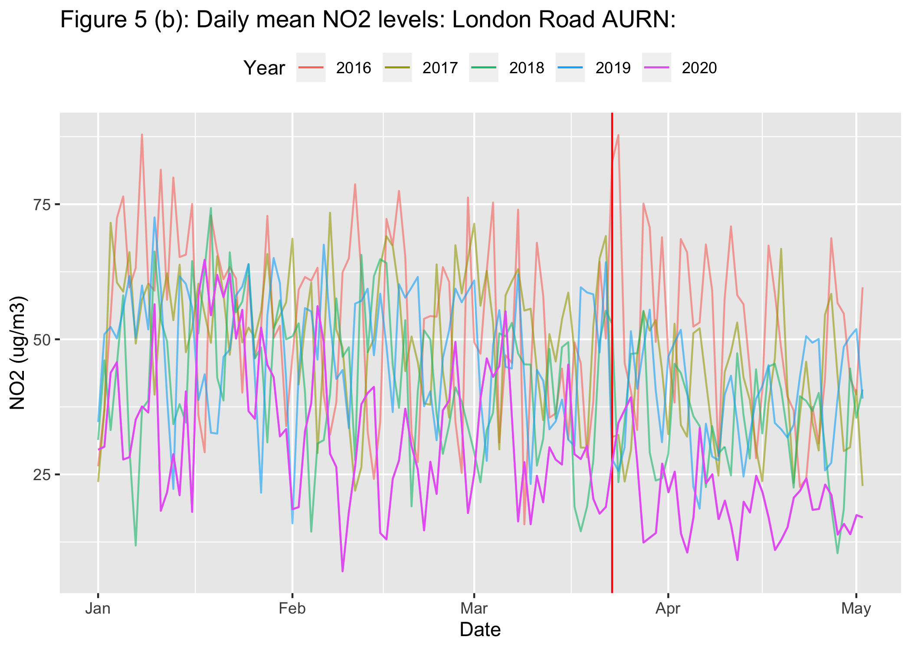

5 - COVID-19 and NO2 pollution levels
================

On Monday 23rd March, the Prime Minister addressed the nation on the coronavirus. New rules were put into action. People were only allowed to leave their home for the following very limited purposes:

-   Shopping for basic necessities, as infrequently as possible.
-   One form of exercise a day - for example a run, walk, or cycle - alone or with members of your household.
-   Any medical need, to provide care or to help a vulnerable person.
-   Travelling to and from work, but only where this is absolutely necessary and cannot be done from home.

This section will examine the effect of these measures on daily mean NO2 levels recorded by the London Road AURN air pollution monitoring station.

``` r
#Loading in packages:
library(tidyverse)
library(broom)
library(openair)
library(lubridate)

#Loading in Lastest Data from Government:
data <- read.csv(file='https://uk-air.defra.gov.uk/data_files/site_data/BHA4_2020.csv',sep=",",header=F)[,1:11]
names <- data[5,]
names(data) <-as.character(unlist(names))
names(data)[6] <- "NO2"
data <- data[-c(1:6),]
data$Day <- substr(data$Date,1,2)
data$Month <- substr(data$Date,4,5)
data$Year <- substr(data$Date,7,10)
data$DateTime <- paste0(data$Year,"-",data$Month,"-",data$Day," ",data$time,":00")
data$DateTime <- as.POSIXct(data$DateTime,format="%Y-%m-%d %H:%M:%OS")
data[,c("DateTime","NO2")] -> lrno2.2020
lrno2.2020$NO2 <- as.numeric(as.character(lrno2.2020$NO2))
#2020 daily mean NO2 levels:
lrno2.2020 %>% group_by(DateTime=cut(as.POSIXct(DateTime),"1 day")) %>% summarise(NO2=mean(NO2,na.rm=TRUE)) %>% ggplot() + geom_line(aes(x=as.POSIXct(DateTime),y=as.numeric(NO2)),size=0.5,alpha=0.8,na.rm=TRUE,col="blue") +
  geom_vline(xintercept=as.POSIXct("2020-03-23-20:30:00"),col="red") + ggtitle("Figure 5 (a): Daily mean NO2 levels: London Road AURN") + ylab("NO2 (ug/m3)") + xlab("Date")
```



Figure 5 (a), shows daily mean NO2 levels measured from the London Road AURN monitoring station from 1st January - 2nd May 2020. The red line on the graph indicates the start of the lockdown restrictions.

Clearly there has been a reduction in NO2 levels following the restrictions. For the week immediately following the restrictions, NO2 levels are still fairly high, and perhaps initially, not all residents were taking the restrictions seriously. The weekend after, however, NO2 levels are reaching the 2nd lowest recorded levels of the year and the weekly amplitude of NO2 levels is much smaller thereafter.

``` r
#Select NO2 data for years 2016-2019:
importAURN(site="Bath",year=c(2016,2017,2018,2019)) %>% mutate(DateTime=as.POSIXct(date),NO2=no2) %>% select(DateTime,NO2) -> lrno2
lrno2$DateTime <- as.character(lrno2$DateTime)
lrno2.2020$DateTime <- as.character(lrno2.2020$DateTime)
lrno2 <- rbind(lrno2,lrno2.2020)
lrno2 %>% group_by(DateTime=cut(as.POSIXct(DateTime), "1 day")) %>% summarise(NO2=mean(NO2,na.rm=TRUE)) -> lrno2.daily.mean

#Function to select data from 1st January - 2nd May for a chosen year from 2016-2020:
air.select <- function(year){
lrno2.daily.mean %>% filter(as.Date(DateTime)>=as.Date(paste0(year,"-01-01"))) %>% filter(as.Date(DateTime)<=as.Date(paste0(year,"-05-02"))) }

#We now get our required data:
lrno2.period <- as.data.frame(rbind(air.select(2016),air.select(2017),air.select(2018),air.select(2019),air.select(2020)))
lrno2.period$year <- year(lrno2.period$DateTime)
lrno2.period$date_x = lrno2.period$DateTime
lrno2.period$date_x <- as.character(lrno2.period$date_x)
substr(lrno2.period$date_x,3,4)="20"

#Now plotting the graph:
ggplot(lrno2.period,aes(x=as.POSIXct(date_x),y=NO2,colour=factor(year)))+geom_line(size=0.5,alpha=0.6) + ggtitle("Figure 5 (b): Daily mean NO2 levels: London Road AURN:") + xlab("Date") + labs(col="Year") + theme(legend.position = "top") + geom_vline(xintercept=as.POSIXct("2020-03-23-20:30:00"),col="red") + ylab("NO2 (ug/m3)") + geom_line(filter(lrno2.period,year=="2020"),mapping=aes(x=as.POSIXct(date_x),y=NO2,colour=factor(year)))
```



Figure 5(b), shows a comparison of the measured NO2 levels from the London Road AURN monitoring station from 1st January - 2nd May 2020. The red line on the graph indicates the start of the lockdown restrictions.

It is not possible to directly compare NO2 levels measured in 2020 to previous years since the air pollution monitoring station moved location in late 2019 (see figure 4 in section 4). Analysing the relative changes in NO2 levels, a dramatic decline can be observed for the year 2020. An initial reduction in the 2020 NO2 levels can be seen following the Cleveland Bridge weight restrictions on 3rd February (as discussed in the previous chapter). Moving into March, the COVID-19 lockdown restrictions have resulted in further reduction to extremely low levels of NO2. In comparison to previous years, NO2 levels have remained at similar levels from January-March, with a very subtle decrease.

Comparing mean NO2 levels from 1st April - 2nd May for 2020 to mean levels for each previous years 2016-2019 via a t-test:

``` r
compare_change <- function(year_Of_Comparison){
#Filter data from 1st April - 2nd May
filter.1.April.to.2.May <- function(year){
lrno2 %>% filter(as.Date(DateTime)>=as.Date(paste0(year,"-04-01"))) %>% filter(as.Date(DateTime)<=as.Date(paste0(year,"-05-02"))) }

#Create Data Frame:
  as.data.frame(rbind(
  filter.1.April.to.2.May(year_Of_Comparison),
  filter.1.April.to.2.May(2020))) -> lrno2.1.April.to.2.May
  
lrno2.1.April.to.2.May  %>% mutate(
  year = year(lrno2.1.April.to.2.May$DateTime)) -> lrno2.1.April.to.2.May

#Select NO2 data for year 2020:
  
lrno2.1.April.to.2.May %>% filter(year==2020) -> NO2.2020
#Select NO2 data for previous years:
lrno2.1.April.to.2.May %>% filter(year!=2020) -> NO2.previous.years

#Perfrom t-test:
t.test(NO2.2020$NO2,NO2.previous.years$NO2)}

#t-tests
data.frame(cbind(year_of_comparison = c("2016","2017","2018","2019"),
                 
                 rbind(tidy(compare_change(2016)),
                 tidy(compare_change(2017)),
                 tidy(compare_change(2018)),
                 tidy(compare_change(2019))))) %>% select(year_of_comparison,estimate1,estimate2,p.value) -> t_tests

colnames(t_tests) <- c("year of comparison","2020 estimate","comparison year estimate","p.value")

t_tests
```

      year of comparison 2020 estimate comparison year estimate       p.value
    1               2016      19.03635                 49.22423 3.482179e-140
    2               2017      19.03635                 40.53714 4.436629e-104
    3               2018      19.03635                 33.75199  2.997376e-61
    4               2019      19.03635                 38.42013 6.900166e-101

Mean NO2 levels from 1st April - 2nd May for the year 2020 are significantly lower than for each of the previous years 2016-2019. Calculating the percentage decrease between the measured NO2 levels for 2020 and for each of the previous years:

``` r
data.frame(t(t_tests$`comparison year estimate`-t_tests$`2020 estimate`)/(t_tests$`comparison year estimate`)) %>% round(3)*100 -> percentage_change
colnames(percentage_change) <- c("2016","2017","2018","2019")
rownames(percentage_change) <- "Percentage change"
percentage_change
```

                      2016 2017 2018 2019
    Percentage change 61.3   53 43.6 50.5

Measured NO2 levels from 1st April - 2nd May for 2020 are 50% lower than for NO2 levels measured over the same period in 2019. However, the 2020 NO2 data would need adjusting to account for the location change of the air pollution monitoring station.
